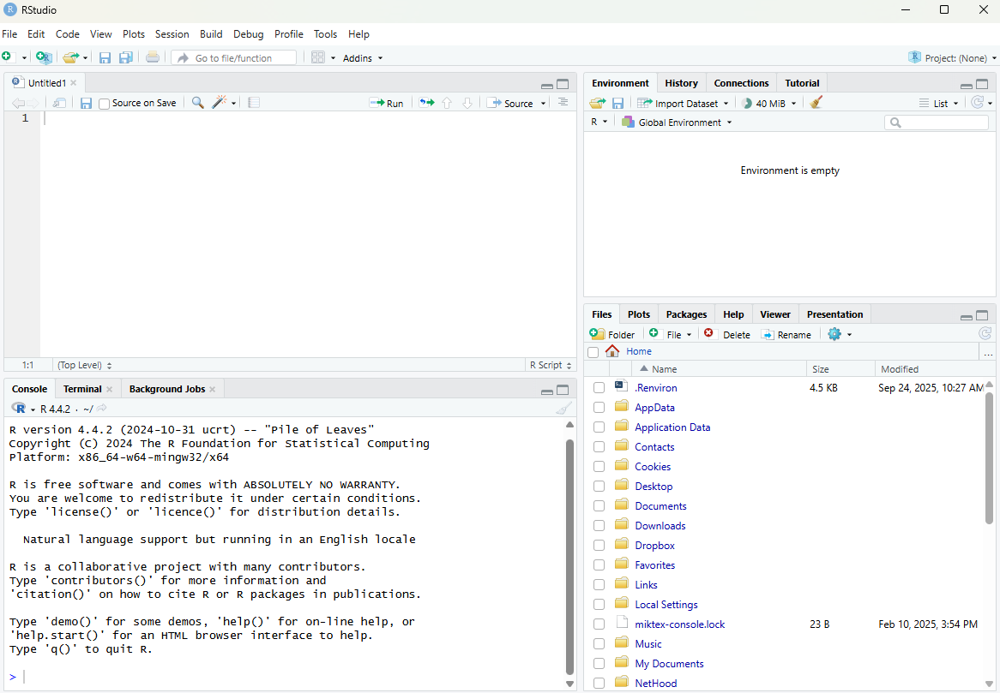
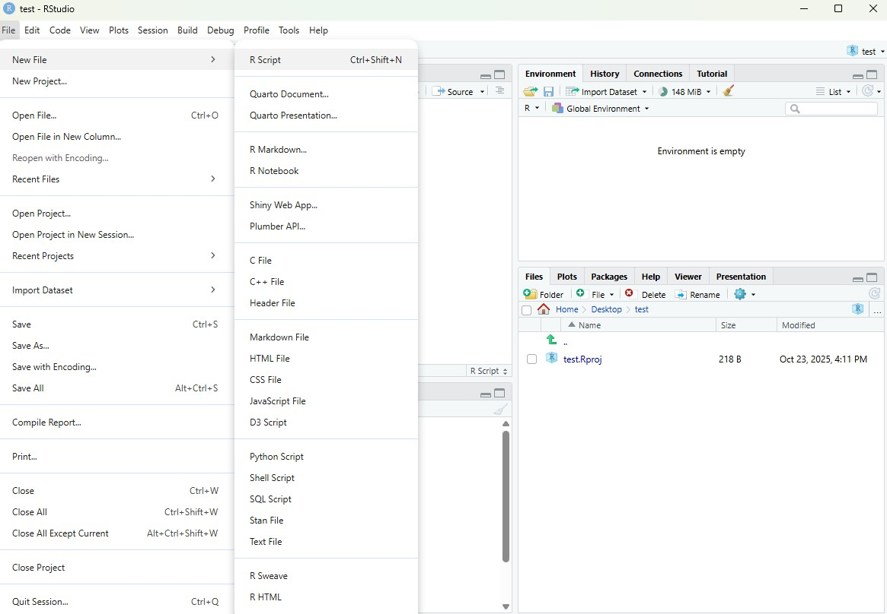
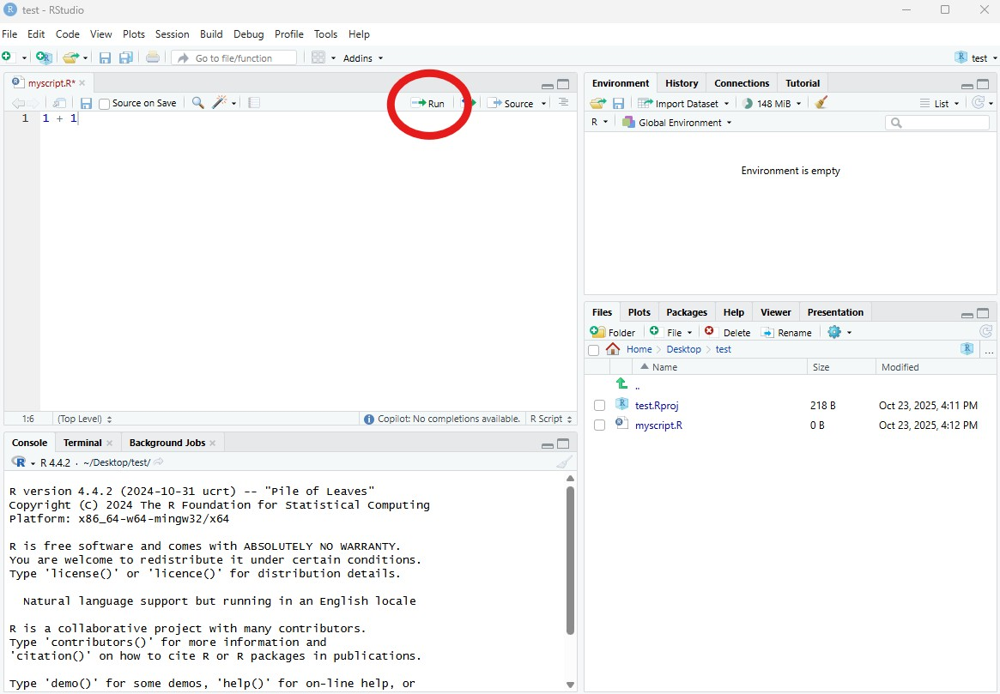

# R basics {#sec-R_basics}

Get the lesson R script: [R_basics.R](R_basics.R)

Get the lesson data: [download zip](data/data.zip)

## Lesson Outline

- [Goals and Motivation]
- [RStudio]
- [R language fundamentals]
- [Data structures in R]
- [Getting your data into R]

## Lesson Exercises

- [Exercise 1]
- [Exercise 2]
- [Exercise 3]

## Goals and Motivation

[R](https://www.r-project.org/){target="_blank"} is a language for statistical computing and general purpose programming. It is one of the best languages for data science and analysis. 

The goals of this training are to expose you to fundamentals and to develop an appreciation of what's possible with this software.  We also provide resources that you can use for follow-up learning on your own. You should be able to answer these questions at the end of this session:

* What is R and why should I use it?
* Why would I use RStudio and RStudio projects?
* How can I write, save, and run scripts in RStudio?
* Where can I go for help?
* What are the basic data structures in R?
* How do I import data? 

### Why should I invest time in R?

There are many programming languages available and each has it's specific benefits. R was originally created as a statistical programming language, but now it is largely viewed as a "data science" language. Why would you invest time learning R compared to other languages?  

Although other languages may have more popularity among general data science communities, R excels in statistics and data visualization. This workshop will expose you to some of the ways that R excels in these areas. 

R is also an open-source programming language - not only is it free, but this means anybody can contribute to it's development. As of `r format(Sys.time(), "%Y-%m-%d")`, there are `r nrow(available.packages(contriburl = 'https://cran.rstudio.com/src/contrib'))` supplemental packages for R on CRAN!   

## RStudio

In the past, the only way to use R was directly from the Console - this is a bare bones way of running R only with direct input of commands. Now, [RStudio](https://www.rstudio.com/){target="_blank"} is the go-to Interactive Development Environment (IDE) for R. Think of it like a car that is built around an engine. It is integrated with the console that runs R (engine) and includes many other features to improve the user's experience, such as version control, debugging, dynamic documents, package manager and creation, and code highlighting and completion. 

If you follow recent data science trends, you may have also heard of [Positron](https://positron.posit.co/){target="_blank"}.  This is the latest IDE developed by Posit, the company behind RStudio. It is viewed somewhat as the successor to RStudio that allows for use of multiple data science programming languages (a polyglot IDE).  It includes many of the same features as RStudio, as well as other advances that may make it more appealing depending on your data science needs.  Most R users are still using RStudio as Positron is relatively new.  However, I suspect Positron will be more widely used in the future and will likely include additional features that expand its capabilities beyond RStudio.  As an introductory R workshop, RStudio is still a great choice, but you may consider migrating to Positron in the future.  

Let's get familiar with RStudio before we go on.  

### Open R and RStudio

If you haven't done so, download and install RStudio from the link above.  After it's installed, find the RStudio shortcut and fire it up (just watch for now).  You should see something like this: 



There are four panes in RStudio: 

* __Source__: Your primary window for writing code to send to the console, this is where you write and save R "scripts" for your code
* __Console__: This is where code from your scripts is executed in R - you will typically not write code here
* __Environment, History, etc.__: A tabbed window showing your working environment, code execution history, and other useful things
* __Files, plots, etc.__: A tabbed window showing a file explorer, a plot window, list of installed packages, help files, and viewer 

### RStudio projects

It is absolutely essential to use RStudio projects when you are working with R.  The RStudio project provides a central location (a file directory) for working on a particular task.  It helps with file management and is portable because all the files live in the same project.  

To create a new project, click on the File menu at the top left and select 'New project...'


Now we can use this project for our data and any scripts we create.  

### Scripting

In most cases, you will not enter and execute code directly in the console.  Code is written in a script in the source pane and then sent directly to the console when you're ready to run it.  The key difference from running code in the console is that a script can be saved and shared.

Open a new script from the File menu...



### Executing code in RStudio

After you write code in your script, it can be sent to the Console to run (execute) in R.  Anything you write in the script will not be run or saved in R's memory until it is sent to the console.  There are two main ways to do this.  First, you can hit the `Run` button at the top right of the scripting window.  The easier way is to use the keyboard shortcut `ctrl+enter` (`cmd+enter` on a Mac).  Both approaches will send the selected line to the console, then move to the next line in your script.  You can also highlight and send an entire block of code.



## Exercise 1

This exercise will make sure R and RStudio are working and that you can get around the basics in RStudio.

1. Start RStudio on your computer OR navigate to [https://posit.cloud/project/11213234](https://posit.cloud/project/11213234){target="_blank"} if using RStudio Cloud. To start both R and RStudio requires only firing up RStudio. In Windows, you can open it by searching for RStudio in the taskbar. 

1. If you're not using RStudio Cloud, create a new project (File menu, New project, New directory, New project, Directory Name...).  Name it "r_workshop".  We will use this for the rest of the workshop.

1. Create a new "R Script" in the Source Pane, save that file into your newly created project and name it "first_script.R". It'll just be a blank text file.

1. Add in a comment line to start a new section.  It should look something like: `# Exercise 1: Just Getting used to RStudio and Scripts`.

1. Lastly, we need to get this project set up with some example data for our exercises (if you're using RStudio Cloud, ignore this step).  Download the zip file [here](data/data.zip) to your desktop. Extract the files so you can copy/paste them to your RStudio project. Create a folder in your new project named `data` and copy the extracted files into this location.  

## R language fundamentals

R is built around functions.  These are commands that do specific things based on what you provide. The basic syntax of a function follows the form: `function_name(arg1, arg2, ...)`.  

With the base install, you will gain access to many functions (`r pkgs <- search(); pkgs <- pkgs[grep("package:",pkgs)]; length(unlist(sapply(pkgs,lsf.str)))`, to be exact). 
Some examples:

```{r}
# print
print('hello world!')

# sequence
seq(1, 10)

# random numbers
rnorm(100, mean = 10, sd = 2)

# average 
mean(rnorm(100))

# sum
sum(rnorm(100))
```

Very often you will see functions used like this:

```{r}
my_random_sum <- sum(rnorm(100))
```

In this case, the first part of the line is the name of an object.  You make this up.  Ideally it should have some meaning, but the only rules are that it can't start with a number and must not have any spaces.  The second bit, `<-`, is the assignment operator.  This tells R to take the result of `sum(rnorm(100))` and store it in an object named `my_random_sum`.  It is stored in the environment and can be used by just executing it's name in the console.

```{r}
my_random_sum
```

### What is the environment?

There are two outcomes when you run code.  First, the code will simply print output directly in the console.  Second, there is no output because you have stored it as a variable using `<-`. Stored output is saved in the `environment`, a collection of named objects that are stored in memory for your current R session.  Anything stored in memory will be accessible by it's name without running the original script that was used to create it.  

With this, you have the very basics of how we write R code and save objects that can be used later.

### Packages

The base install of R is quite powerful, but you will soon have a need to go beyond these core tools.  Packages provide this ability.  They are a standardized way of extending R with new methods, techniques, and programming functionality.  There is a lot to say about packages regarding finding them, using them, etc., but for now let's focus on the basics.  

### CRAN

One of the reasons for R's popularity is CRAN, [The Comprehensive R Archive Network](http://cran.r-project.org/){target="_blank"}.  This is where you download R and also where most will gain access to packages (there are other places, but that is for later).  Not much else to say about this now other than to be aware of it.  As of `r format(Sys.time(), "%Y-%m-%d")`, there are `r nrow(available.packages(contriburl = 'https://cran.rstudio.com/src/contrib'))` packages on CRAN! 

### Installing packages

Installing packages from CRAN is done in R. When a package gets installed, that means the source code is downloaded and put into your library.  A default library location is set for you so no need to worry about that.  In fact, on Windows most of this is pretty automatic.  Let's give it a shot.

## Exercise 2

We're going to install some packages from CRAN that will give us the tools for our workshop today.  We'll use the tidyverse, sf, and mapview packages.  Later, we'll explain in detail what each of these packages provide.  Again, if you are using RStudio Cloud, these packages will already be installed.  You can skip to step 5 in this case.  

1. At the top of the script you just created, type the following functions.

   ```{r}
   #| eval: false
   # install packages from CRAN
   install.packages("tidyverse")
   install.packages("sf")
   install.packages("mapview")
   ```

1. Select all the lines by clicking and dragging the mouse pointer over the text.  

1. Send all the commands to the console using `ctrl+enter`.  You should see some text output on the console about the installation process.  Don't be alarmed if the installation takes a few minutes.  

1. After the packages are done installing, verify that there were no errors during the process (this should be pretty obvious, i.e., error text in big scary red letters).

1. Load the packages after they've installed. You should see some text output during the loading process. 

   ```{r}
   #| message: false
   #| warning: false
   #| results: hide
   library("tidyverse")
   library("sf")
   library("mapview")
   ```

An important aspect of packages is that you only need to download them once, but every time you start RStudio you need to load them with the `library()` function.  Loading a package makes all of its functions available in your current R session.  The only time you need to reinstall a package is to get an updated version.

## Getting Help

Being able to find help and interpret that help is probably one of the most important skills for learning a new language.  R is no different. Help on functions and packages can be accessed directly from R, can be found on CRAN and other official R resources, searched on Google, or from any number of fantastic online resources. Generative AI is also a great service for troubleshooting code (with many caveats). I will cover a few of these here. 

### Help from the console

Getting help from the console is straightforward and can be done numerous ways.

```{r}
#| eval: false
# Using the help command/shortcut
# When you know the name of a function
?print # Help on the print command using the `?` shortcut

# When you know the name of the package
help(package = "sf") # Help on the package `sf`

# Don't know the exact name or just part of it
??print # shortcut, but also searches demos and vignettes in a formatted page
```

### Official R Resources

In addition to help from within R itself, CRAN and the R-Project have many resources available for support.  Two of the most notable are the mailing lists and the [task views](http://cran.r-project.org/web/views/){target="_blank"}.

- [R Help Mailing List](https://stat.ethz.ch/mailman/listinfo/r-help){target="_blank"}: The main mailing list for R help.  Can be a bit daunting and some (although not most) folks can be, um, curmudgeonly...
- [R-sig-ecology](https://stat.ethz.ch/mailman/listinfo/r-sig-ecology){target="_blank"}: A special interest group for use of R in ecology.  Less daunting than the main help with participation from some big names in ecological modelling and statistics.
- [Environmetrics Task View](http://cran.r-project.org/web/views/Environmetrics.html){target="_blank"}: Task views are great because they provide an annotated list of packages relevant to a particular field.  This one has great info on packages relevant to the environmental sciences.
- [Spatial Analysis Task View](http://cran.r-project.org/web/views/Spatial.html){target="_blank"}: This task view lists all the relevant packages for spatial analysis, GIS, and Remote Sensing in R. 

### Google

While the resources already mentioned are useful, often the quickest way to get help is to Google.  However, a search for just "R" is a bit challenging.  A few ways around this.  Google works great if you search for a given package or function name.  You can also search for mailing lists directly (i.e. "R-sig-geo"), although Google often finds results from these sources.

Blind googling can require a bit of strategy to get the info you want.  Some pointers:

* Always preface the search with "R"
* Understand which sources are reliable
* Take note of the number of hits and date of a web page
* When in doubt, search with the exact error message (see here for [details](https://cran.r-project.org/doc/manuals/R-lang.html#Exception-handling){target="_blank"} about warnings vs errors)
 
### Generative AI

Generative AI tools built with Large Language Models have dramatically changed the coding landscape in the last few years. They will continue to change how we code as the tools are constantly evolving. You can use them to generate code or to troubleshoot code you already have. Pasting problematic code or error messages will often produce a more useful result than Googling.  

The most important thing to remember is they __ARE NOT__ substitutes for the conventional learning process.  While it's true you can generate a lot of useful code with minimal experience, you will have no way of knowing what this code does or how to troubleshoot it when it doesn't work.  Use these tools as a supplement to your learning, not a replacement. 

There is too much to say about generative AI in this space, but here are a few tips to effectively use those tools:

* Use precise, clear prompts with as much detail as possible to help the model understand what you want.
* Understand which platforms are best for coding.  Currently, [Claude](https://claude.ai){target="_blank"} seems to be the preferred model for data science.
* Never include sensitive or proprietary information in your prompts.  Once it's submitted to a prompt, it's out of your control.
* Always verify the code that's been generated. The human backstop is the key factor that keeps the output under control.  Don't ever [vibe code](https://en.wikipedia.org/wiki/Vibe_coding){target="_blank"}. 

### Other Resources

As mentioned earlier, there are TOO many resources to list here and everyone has their favorites.  Please see the [Data and Resources](data_resources.html) page for additional links to R learning resources.

## Data structures in R

Now that you know how to get started in R and where to find resources, we can begin talking about R data structures. Simply put, a data structure is a way for programming languages to handle information storage.

There is a bewildering amount of formats for storing data and R is no exception. Understanding the basic building blocks that make up data types is essential.  All functions in R require specific types of input data and the key to using functions is knowing how these types relate to each other.  

### Vectors (one-dimensional data)

The basic data format in R is a vector - a one-dimensional grouping of elements that have the same type.  These are all vectors and they are created with the `c` (concatenate) function:

```{r}
dbl_var <- c(1, 2.5, 4.5)
int_var <- c(1L, 6L, 10L)
log_var <- c(TRUE, FALSE, T, F)
chr_var <- c("a", "b", "c")
```

The four types of atomic vectors (think atoms that make up a molecule aka vector) are `double` (or numeric), `integer`, `logical`, and `character`. Each type has some useful properties:

```{r}
class(dbl_var)
length(log_var)
```

These properties are useful for describing an object and they also define limits on which functions or types of operations that can be used.  That is, some functions require a character string input while others require a numeric input. Similarly, vectors of different types typically do not play well together. Let's look at some examples:

```{r}
#| eval: false
# taking the mean of a character vector
mean(chr_var)

# adding two numeric vectors of different lengths
vec1 <- c(1, 2, 3, 4)
vec2 <- c(2, 3, 5)
vec1 + vec2
```

### 2-dimensional data

A collection of vectors represented as one data object are often described as two-dimensional data, or in R speak, a data frame (i.e., `data.frame()`).  Think of them like your standard spreadsheet, where each column describes a variable (vector) and rows link observations between columns.  Here's a simple example:

```{r}
ltrs <- c('a', 'b', 'c')
nums <- c(1, 2, 3)
logs <- c(T, F, T)
mydf <- data.frame(ltrs, nums, logs)
mydf
```

The only constraints required to make a data frame are:

1. Each column (vector) contains the same type of data

1. The number of observations in each column is equal.

## Getting your data into R

It is the rare case when you manually enter your data in R, not to mention impractical for most datasets.  Most data analysis workflows typically begin with importing a dataset from an external source.  Literally, this means committing a dataset to memory (i.e., storing it as a variable) as one of R's data structure formats.

Flat data files (text only, rectangular format) present the least complications on import because there is very little to assume about the structure of the data. On import, R tries to guess the data type for each column and this is fairly unambiguous with flat files.  We'll be using the `read_csv()` function from the readr package that comes with the tidyverse.

## The working directory 

Before we import data, we need to talk about the "working directory".  Whenever RStudio is opened, it uses a file location on your computer to access and save data.  If you're using an RStudio project, the working directory will be the folder where you created the project.  If not, it is probably your operating system's home directory (e.g., `C:/Users/Marcus`), which you'll want to change.  

You can see your working directory with the `getwd()` function or from the file path at the top of the console in RStudio.  All files in the File pane window on the bottom right of RStudio are also those within the working directory.  If you want to change your working directory, you can use the `setwd()` function and put the file path (as a character string) inside the function, e.g., `setwd('C:/Users/Marcus/Desktop/newdirectory')`. You will not need to set the working directory for an RStudio project since it is set automatically.  In fact, you will rarely set the working directory by hand.

The working directory is important to know when you're importing or exporting data.  When you import data, a *relative* file path can be used that is an extension of the working directory.  For example, if your working directory is `'C:/Users/Marcus/Desktop'` and you have a file called `mydata.csv` in that directory,  you can use `read_csv('mydata.csv')` to import the file.  If your file is in a folder called "data" in your working directory, you would use `read_csv('data/mydata.csv')`.

If you want to import a file that is not in your working directory, you will have to use an *absolute* path that is the full file location.  Otherwise, R will not know where to look outside of the working directory.  

## Exercise 3

Now that we have the data downloaded and extracted to our data folder, we'll use `read_csv()` to import two files into our environment.  The `read_csv()` function comes with the tidyverse package, so make sure  it's loaded (i.e., `library(tidyverse)`) before you do this exercise.  This should have been done in the second exercise.

1. Type the following in your script.  Note the use of *relative* file paths within your project (see the explanation above).

   ```{r}
   dat <- read_csv('data/dat.csv')
   statloc <- read_csv('data/statloc.csv')
   ```

1. Send the commands to the console with `ctrl+enter`.

1. Verify that the data imported correctly by viewing the first six rows of each dataset.  Use the `head()` function directly in the console, e.g., `head(dat)` or `head(statloc)`

Let's explore the datasets a bit.  There are many useful functions for exploring the characteristics of a dataset.  This is always a good idea when you first import something.  

```{r}
# get the dimensions
dim(dat)
dim(statloc)

# get the column names
names(dat)
names(statloc)

# see the first six rows
head(dat)
head(statloc)

# get the overall structure
str(dat)
str(statloc)
```

You can also view each dataset in a spreadsheet style in the scripting window:

```{r}
#| eval: false
View(dat)
View(statloc)
```

## Other ways to import data

You might want to import an Excel spreadsheet as well. In the old days, importing spreadsheets into R was almost impossible given the proprietary data structure used by Microsoft.  The tools available in R have since matured and it's now pretty painless to import a spreadsheet.  The `readxl` package is the most recent and by far most flexible data import package for Excel files. It comes with the `tidyverse` family of packages.

Once installed, we can load it to access the import functions.

```{r}
#| eval: false
library(readxl)
dat <- read_excel('location/of/excel/file.xlsx')
```

## Summary

In this lesson we learned about R and Rstudio, some of the basic syntax and data structures in R, and how to import files.  We've just imported some provisional training data that we'll continue to use for the rest of the workshop.  Next we'll learn how to process and plot these data to gain insight into how these data vary through space and time.___BEGIN___COMMAND_DONE_MARKER___0
