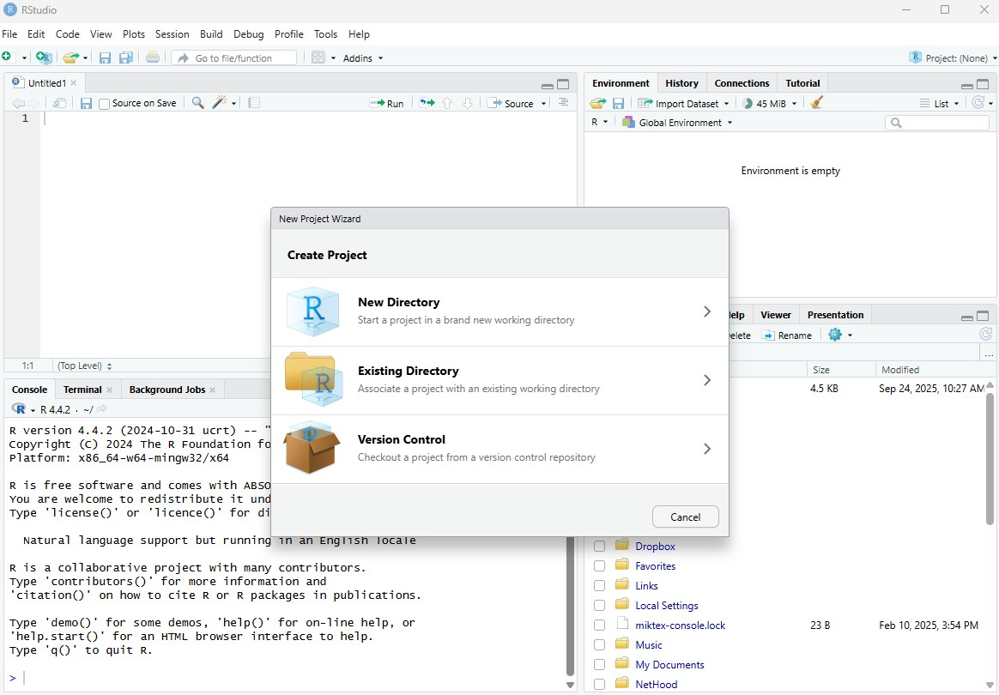

# R overview {#sec-R_overview}

Get the lesson R script: [R_overview.R](R_overview.R)

Get the lesson data: [download zip](data/data.zip)

## Lesson Outline

- [Goals and framing]
- [Project-oriented workflow in RStudio]
- [Accessing SWFWMD data]
- [Troubleshooting and getting help]
- [Generative AI as a support tool]

## Lesson Exercises

- [Exercise 1]
- [Exercise 2]
- [Exercise 3]

## Goals and framing

[R](https://www.r-project.org/){target="_blank"} is a language for statistical computing and general purpose programming. It is one of the best languages for data science and analysis. 

This session is not intended to teach R from the ground up. Instead, it is meant for participants who can already run code in RStudio and want to become more effective using R for day-to-day work. The emphasis is on reproducible workflows, programmatically retrieving SWFWMD data, troubleshooting errors, and building confidence with realistic analysis tasks.

You should be able to answer these questions at the end of this session:

* How should I organize an R project so my work is reproducible?
* How do relative file paths and project structure prevent common errors?
* How can I use the [SWFWMD Environmental Data Portal](https://www.swfwmd.state.fl.us/resources/data-maps/environmental-data-portal){target="_blank"} to programmatically retrieve data?
* Where can I go for help?
* How can AI help me troubleshoot without replacing the learning process?

## Project-oriented workflow in RStudio

[RStudio](https://posit.co/download/rstudio-desktop/){target="_blank"} is the primary teaching environment for this workshop. It gives you one place to write scripts, run code, inspect objects, review files, and view plots. You can leverage RStudio in a way that makes your projects portable and understandable.

### Why projects matter

An RStudio Project gives a single home for data, scripts, figures, and outputs associated with one analysis. This matters because many frustrating R problems are really project management problems:

* file not found errors from incorrect paths,
* code that only works on one person's computer,
* overwritten outputs,
* and difficulty understanding where a script expects its inputs to live.

When you work inside a project, your scripts can use relative paths such as `data/dat.csv` instead of hard-coded absolute paths tied to one machine.


There are four panes in RStudio:

* __Source__: Your primary window for writing code to send to the console, this is where you write and save R "scripts" for your code
* __Console__: This is where code from your scripts is executed in R - you will typically not write code here
* __Environment, History, etc.__: A tabbed window showing your working environment, code execution history, and other useful things
* __Files, plots, etc.__: A tabbed window showing a file explorer, a plot window, list of installed packages, help files, and viewer 

### RStudio projects

It is good practice to start each new task in a fresh project. The project directory becomes the working context for your analysis and should usually contain subfolders for raw data, scripts, derived outputs, and figures.

To create a new project, click on the File menu at the top left and select 'New project...'



Now we can use this project for our data and any scripts we create.

### Relative paths and folder structure

Inside a project, your script should point to files relative to the project root:

```{r}
# project-relative file paths
data_file <- file.path("data", "dat.csv")
station_file <- file.path("data", "statloc.csv")
```

Better yet, get in the habit of using the [here](https://here.r-lib.org/){target="_blank"} package to construct paths relative to the project root:

```{r}
library(here)

# project-relative file paths using here
data_file <- here("data", "dat.csv")
station_file <- here("data", "statloc.csv")
```

This is preferable to absolute paths such as `C:/Users/name/Desktop/...`, which usually fail as soon as the code moves to a different computer or folder.

### Scripting

In most cases, you should write code in scripts and send it to the console as needed. A saved script is easier to share, troubleshoot, review, and reuse than code typed interactively into the console and lost when the session closes.

Open a new script from the File menu:


After you write code in your script, use the `Run` button or `ctrl+enter` (`cmd+enter` on a Mac) to send lines to the console.


### Modular projects

An RStudio project is simply a folder on your computer.  All of your data, scripts, and outputs can live in that folder.  You can create subfolders for different parts of your analysis.  For example, you might have a `data` folder for raw data, an `R` folder for your R scripts, and a `figs` folder for figures you create. As noted above, all file paths should be relative to the project root, so you can move the entire project folder to a different location or share it with someone else without breaking your code.

An RStudio project also contains a file with the extension `.Rproj`.  This file contains information about the project and is used by RStudio to open the project.  You can share this file with others, but you should not edit it directly.  Instead, use the RStudio interface to manage your project.

Rather than sharing a script with someone else, you can share the entire project folder.  This way, they can open the project in RStudio and have access to all of the data, scripts, and outputs.  This is especially useful for collaborative work.

## Exercise 1

This exercise sets up the project structure for the rest of the workshop.

1. Start RStudio on your computer.

1. Create a new project (File menu, New project, New directory, New project, Directory Name...). Name it `swfwmd_r_training`.

1. Inside the project, create folders named `data`, `R`, and `figs`.

1. Create a new script in the Source pane and save it as `scripts\workflow_notes.R`.

1. Add a short header comment to the file that explains what the script is for.

1. Download the training zip file [here](data/data.zip), extract it, and copy the provided data into your project `data` folder.

## Accessing SWFWMD data

One goal for this workshop is to use examples that look more like real SWFWMD work. A useful way to do that is to access data from the SWFWMD [Environmental Data Portal](https://www.swfwmd.state.fl.us/resources/data-maps/environmental-data-portal){target="_blank"} and then use those data in later wrangling, plotting, and spatial examples.

For now, think of portal access as another data import step. The main ideas are:

* build a request URL carefully,
* import the result into R,
* inspect the structure immediately,
* and save or reuse the result in later steps of the workflow.

For this workshop, we'll be working with three different types of data, all of which are obtained from the SWFWMD data portal.

* Station metadata
* Station water quality data
* Station water levels

These can be obtained by using a constructed web address (URL) with the information you like.  

An example URL pattern for requesting station metadata looks like this.  The API has a URL generator [here](https://www33.swfwmd.state.fl.us/URLBuilder_External/?_ga=2.250015622.1486516868.1782417832-1354077163.1767879681) that can create these requests.  The URL below retrieves station metadata for all active stations in Lake Panasoffkee.  The request is broken into parts to make it easier to read.

```{r}
metaurl <- paste0(
  "https://edp.swfwmd.state.fl.us/KiWIS/KiWIS?",
  "service=kisters&type=queryServices&request=getStationList",
  "&station_no=*&datasource=0",
  "&returnfields=station_no,station_name,station_latitude,station_longitude,ca_sta",
  "&format=csv&csvdiv=,",
  "&downloadfilename=Requested_Info_",
  "&custattrfilter=station_status:Active;WaterBody_Name:Lake%20Panasoffkee"
)
metaurl
```

Entering this address in a web browser will download a csv file with the info you need.  We can skip this step by importing it directly into R. 

```{r}
# import the data
metadat <- read.csv(metaurl)
dim(metadat)
```

Our request returned information for `r nrow(metadat)` active stations (as rows) in Lake Panasoffkee.  There's also a bunch of columns (`r ncol(metadat)` to be exact) that we probably don't need, but we'll deal with those later.  For now, we'll use the station numbers (`station_no`) to retrieve water quality data and lake levels using another request.

The URL request for water quality looks like this.  We've constructed it to retrieve the active stations in Lake Panasoffkee. 

```{r}
# get the stations
stations <- metadat$station_no

# construct the URL with the stations
wqurl <- paste0(
  "https://edp.swfwmd.state.fl.us/",
  "KiWIS/KiWIS?datasource=0",
  "&format=csv&csvdiv=,",
  "&service=kisters&type=queryServices",
  "&request=getWqmSampleValues",
  "&station_no=", paste(stations, collapse = ','),
  "&period=complete",
  "&dateformat=yyyy-MM-dd%20HH:mm:ss"
)

# retrieve the data
wqdat <- read.csv(wqurl)
head(wqdat)
dim(wqdat)
```

The data we retrieved included `r nrow(wqdat)` rows and `r ncol(wqdat)` columns. Also note that the data did not include all stations.  Only those with water quality data were returned. It may not be immediately obvious that your request did not return all stations until you actually look at the results. 

```{r}
unique(wqdat$station_no)
setdiff(stations, unique(wqdat$station_no))
```

The last data request we'll make is for *water level* data.  These differ from the *water quality* data because they're "continuous" in time, i.e., time series data, as opposed to "discrete" water quality samples taken at one point in time. We have to request the water level data one station at a time given the amount of data that are retrieved.  The requests also use a `ts_path`: `something/station number/something else/some more stuff`.  I don't know what this... I hope you do.

This requests data for station 1035944. 

```{r}
wlurl1 <- paste0(
  "https://edp.swfwmd.state.fl.us/",
  "KiWIS/KiWIS?datasource=0&service=kisters", 
  "&type=queryServices",
  "&request=getTimeseriesValues", 
  "&ts_path=362/1035944/236/Day.Mean.NAVD88.Published",
  "&returnfields=Timestamp,Value&metadata=TRUE",
  "&md_returnfields=station_no,station_name,ts_unitsymbol",
  "&period=complete",
  "&dateformat=yyyy-MM-dd%20HH:mm:ss", 
  "&timezone=individual",
  "&format=csv&csvdiv=,"
)

wldat1 <- read.csv(wlurl1)
dim(wldat1)
head(wldat1)
```

This requests data for station 23142. 

```{r}
wlurl2 <- paste0(
  "https://edp.swfwmd.state.fl.us/",
  "KiWIS/KiWIS?datasource=0&service=kisters", 
  "&type=queryServices",
  "&request=getTimeseriesValues", 
  "&ts_path=1334/23142/236/Day.Mean.NAVD88.Published",
  "&returnfields=Timestamp,Value&metadata=TRUE",
  "&md_returnfields=station_no,station_name,ts_unitsymbol",
  "&period=complete",
  "&dateformat=yyyy-MM-dd%20HH:mm:ss", 
  "&timezone=individual",
  "&format=csv&csvdiv=,"
)

wldat2 <- read.csv(wlurl2)
dim(wldat2)
head(wldat2)
```

None of the data we requested is ready for analysis.  Not only do we need to figure out what we want to do, but we also need to clean it up (wrangle) based on the needs of the analysis.  We'll deal with that later.  For now, we can save the results to retrieve them later. 

```{r}
write.csv(metadat, "data/metadat.csv", row.names = F)
write.csv(wqdat, "data/wqdat.csv", row.names = F)
write.csv(wldat1, "data/wldat1.csv", row.names = F)
write.csv(wldat2, "data/wldat2.csv", row.names = F)
```

A final note about APIs:

* Sometimes you will need to make the request again if it fails on the first try.  The request can be fickle based on your web connection and the server load.
* I noticed that the above request for the metadata returned `r nrow(metadat)` columns, but I only requested five fields. This is clearly not working correctly. 
* APIs often change over time, so you may need to consult the online documentation for the correct format if something is not working as expected.
* Most APIs also have limits on the amount of data you can retrieve per request.  You will need to make requests iteratively within a loop to get all the data you need, but that is beyond the scope of this workshop.

## Exercise 2

Use the project you created in Exercise 1 and inspect the example data.

1. Load the `here` and `tidyverse` packages.

1. Import `metadat.csv` and `wqdat.csv` with `read.csv()`using relative file paths constructed with the `here()` function.

1. Use `names()`, `dim()`, `head()`, or `glimpse()` to inspect each dataset.

1. Write two or three short notes in your script about what each file appears to contain and how it might be used later in the workflow.

## Troubleshooting and getting help

Troubleshooting is a core skill for this workshop. Before changing code, make the problem smaller and more specific. Useful first checks include:

* Does the file path exist?
* Did the package load successfully?
* What is the class or structure of the object?
* Which line produced the error?
* Is the code failing because the input data are different than expected?

Many problems become much easier once you inspect the object directly instead of guessing what it contains.

### Help from the console and documentation

Getting help from the console is straightforward:

```{r}
#| eval: false
?read_csv
help(package = "dplyr")
??mutate
```

You should also get comfortable with package websites, vignettes, and worked examples. Searching the exact error message is often more effective than searching a vague description of the problem.

## Generative AI as a support tool

Generative AI can be genuinely useful for data science, especially when you need help understanding an inherited script or unpacking an error message. In many cases it is faster than a web search for:

* explaining what a script is doing step by step,
* suggesting why an error occurred,
* translating unfamiliar code into plainer language,
* or outlining a debugging strategy.

The tradeoff is that AI can sound confident while being wrong, can overcomplicate a fix, and can nudge users toward copying code they do not understand. Use it to support your reasoning, not replace it.

Some practical guidelines:

* Give the model the code, the error message, and a short description of what you expected to happen.
* Ask it to explain before asking it to rewrite.
* Verify every suggested fix.
* Never paste sensitive or proprietary information into a public tool.

## Exercise 3

Use a short script from this lesson or one of your own and practice a structured review.  If you can access a generative AI tool, you can use that to help dissect the script.  Try looking at the [R_overview.R](R_overview.R) file or one of your own if you prefer.

1. Identify which packages it loads.

1. Identify which files it expects.

1. Identify the main objects it creates.

1. If something fails, write down the exact error and list the first two things you would inspect before changing the code.

## Summary

In this lesson we framed the workshop around a reproducible workflow and imported data we'll use later. The most important themes were: use projects, keep paths relative, inspect data early, read scripts in stages, and troubleshoot carefully. Next, we can build on that foundation with data wrangling tasks that move from clear examples into SWFWMD-style workflows.
