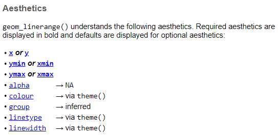
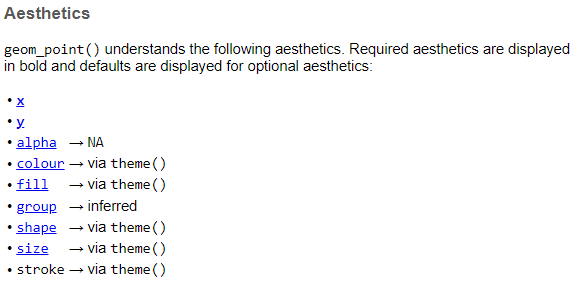
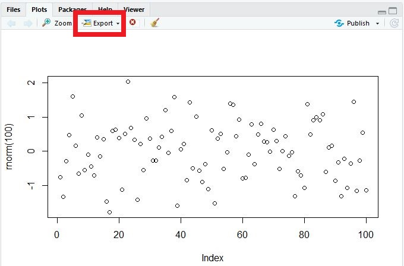

# Data viz {#sec-data_viz}

Get the lesson R script: [data_viz.R](data_viz.R)

Get the lesson data: [download zip](data/data.zip)

## Lesson Outline

* [GGplot2]
     * [Basics]
     * [Modifying plot components]
* [Saving your plots]

## Lesson Exercises

* [Exercise 9]
* [Exercise 10]

## Goals

This section will introduce you to concepts of data visualization and graphics in R.  The entire workflow of data exploration is enhanced through looking at your data, whether you're exploring a dataset for the first time or creating publication-ready figures. Viewing your data provides insight into patterns that can help you evaluate different hypotheses.  No analysis is complete without visualizing your data.  


Graphics capabilities in R have improved tremendously over time. The de facto plotting library is `ggplot2` as part of the `tidyverse`, but there are many other packages available that enhance or build on existing functionality.  The base R installation also comes with its own set of plotting functions.  Base R plotting functions are useful for quick and dirty exploration but you'll quickly find that these methods are tedious.  For this lesson, we'll focus on `ggplot2`.

After this lesson you should be able to answer (or be able to find answers to) the following:

* What are the requirements of every ggplot?
* What are geoms?
* What are facets?
* What are themes?
* How do I save a plot?

## GGplot2

### Basics

The `ggplot2` package (full [reference](http://ggplot2.tidyverse.org/index.html){target="_blank"}) is a huge improvement over base R because it was developed following a strict philosophy known as the *grammar of graphics*.  This philosophy was designed to make thinking, reasoning, and communicating about graphs easier by following a few simple rules.  Like building a sentence in speech (aka grammar), all graphs start with a foundational component that is used for building other graph pieces.  

For these examples, we'll focus on one parameter at one station.  Later, we'll work with the continuous data for some more interesting examples.

```{r}
# load packages
library(tidyverse)
library(here)

# import water quality data
wqdat <- read_csv(here('data', 'wqdat.csv'))

# prepare data to plot (toplo)
toplo <- wqdat |> 
  filter(station_name == 'Lake Panasoffkee 4' & parametertype_name == 'Temperature, Water') |> 
  mutate(
    timestamp = lubridate::with_tz(timestamp, tzone = 'Etc/GMT+5')
  )
```

With ggplot2, you begin a plot with the function `ggplot()`. `ggplot()` creates a coordinate system for adding "geometries" (aka `geoms`). The first argument of `ggplot()` is the dataset to use in the graph. So, `ggplot(data = mpg)` creates an empty base graph.

```{r}
#| eval: false
ggplot(data = toplo)
```

The next step is to add one or more `geoms` to `ggplot()`. The function `geom_point()` adds a layer of points to your plot, which creates a scatterplot. There are many geom functions that each add a different type of layer to a plot.

```{r}
#| eval: false
ggplot(data = toplo) +
  geom_point()
```

Each geom function in ggplot2 takes a `mapping` argument. This defines how variables in your dataset are mapped to visual properties. The `mapping` argument is defined with `aes()` for aesthetics, and the `x` and `y` arguments of `aes()` specify which variables to map to the x and y axes. The geom functions look for the mapped variable in the `data` argument, in this case, `mpg`.

```{r}
#| eval: false
ggplot(data = toplo) +
  geom_point(mapping = aes(x = timestamp, y = value))
```

Just remember these requirements:

* All plots start with the `ggplot` function
* It will need three pieces of information: the **data**, how the data are **mapped** to the plot **aesthetics**, and a **geom** layer

The core unit of every ggplot looks like this:

```{r}
#| eval: false
ggplot(data = <DATA>) + 
  <GEOM_FUNCTION>(mapping = aes(<MAPPINGS>))
```

Applied to the data:

```{r}
ggplot(data = toplo) + 
  geom_point(mapping = aes(x = timestamp, y = value))
```

More commonly, the `aes` function that defines the mapping is included in the initial call to `ggplot`.  This will globally define the mapping to all geoms in a plot, instead of for only one geom. There may be different reasons to globally apply the aesthetics or separately for each geom depending on the data.   

```{r}
ggplot(data = toplo, mapping = aes(x = timestamp, y = value)) + 
  geom_point()
```

Why the need for this complicated structure? The syntax of mapping aesthetics to a dataset lets you easily modify components of an existing plot.  Additional datasets and geoms can easily be added to the plot with `+`.  

Let's explore some of the other geoms. 

As lines...

```{r}
ggplot(toplo, aes(x = timestamp, y = value)) + 
  geom_line()
```

As counts...

```{r}
ggplot(toplo, aes(x = timestamp, y = value)) + 
  geom_count()
```

As density...

```{r}
ggplot(toplo, aes(x = timestamp, y = value)) + 
  geom_density2d()
```

As a line range...

```{r}
#| eval: false
ggplot(toplo, aes(x = timestamp, y = value)) + 
  geom_linerange()
```
```
Error in `geom_linerange()`:
! Problem while setting up geom.
ℹ Error occurred in the 1st layer.
Caused by error in `compute_geom_1()`:
! `geom_linerange()` requires the following missing aesthetics: ymin
  and ymax or xmin and xmax.
```

Oh snap, what happened? This error is telling us that the geom we just tried is missing some required aesthetics in the plot.  Here we've only used the `x` and `y` aesthetics but it looks like it requires `ymin` and `ymax`.  Lets look at the help file for `geom_linerange`.

```{r}
#| eval: false
?geom_linerange
```


Looks like we don't have the required aeshetics, nor does it make sense to use this geom because it's not appropriate for the data.  What about the requirements for `geom_point`?

```{r}
#| eval: false
?geom_point
```


We've got the required aesthetics in our plot. Let's add some others that we can use with `geom_point`.

Changing the color:

```{r}
ggplot(toplo, aes(x = timestamp, y = value, colour = timestamp)) + 
  geom_point()
```

Changing the size:

```{r}
ggplot(toplo, aes(x = timestamp, y = value, size = value)) + 
  geom_point()
```

Changing the shapes:

```{r}
ggplot(toplo, aes(x = timestamp, y = value, shape = am(timestamp))) + 
  geom_point()
```

In all of the above examples we've mapped an aesthetic to a variable in our dataset. We can just as easily modify the plot without mapping it to a variable (i.e., changing a part of the plot independent of the data).  For example, maybe we want to change the color of the points using a single color for everything.  Notice the placement of `colour` outside of the `aes()` mapping function.

```{r}
ggplot(toplo, aes(x = timestamp, y = value)) + 
  geom_point(colour = 'red')
```

## Exercise 9

Let's create a nice ggplot for a different site and parameter. This requires us to wrangle the data we want to plot.  Then we can map the `timestamp` and `value` variables to the x and y aesthetics for `geom_point`. 

1. Filter the `wqdat` dataset for a site and parameter of your choosing.

1. Setup your initial plot with `ggplot()`.  Map the x variable to `timestamp` and the y variable to `value`.  The setup should look like this: `ggplot(toplo, aes(x = timestamp, y = value))`).  What happens if you run only this code?

1. Add the `geom_point()` geom to your plot using the `+` operator. Remember the correct placement of `+`, it always occurs in the line preceding the layer that is being added to the plot.

1. Make it look a little nicer by changing the labels using the `labs()` function (see `?labs` for more info).  Give it more meaningful x and y axis labels.  Also add an informative title.   How does the plot look now?

```{r}
#| eval: false
#| echo: true
#| code-fold: true
#| code-summary: "Click to show/hide solution"
toplo <- wqdat |> 
  filter(station_name == "Lake Panasoffkee 8" & parametertype_name == "Dissolved Oxygen")

ggplot(toplo, aes(x = timestamp, y = value)) +
  geom_point() + 
  labs(
    x = "Date", 
    y = "mg/L",
    title = "Dissolved oxygen at station Lake Panasoffkee 8"
  )
```

## Modifying plot components

There are countless ways we can modify a ggplot, either by manipulating the appearance or adding information that improves our understanding of what we see.  In the previous exercise, we used a scale to transform an axis.  In this next section we'll cover three additional ways to modify a plot:

* Modifying the appearance of the plot as a whole can be done using the `theme()` function for individual parts or by using a pre-packaged theme that modifies many parts at once. 
* Adding statistical summaries with `stat_smooth()`
* Making multi-panel plots with `facet_wrap()` or `facet_grid()`.

Before we proceed, we'll use the example data from the previous lesson.  We'll also add a new variable for AM/PM sampling time.

```{r}
toplo <- toplo <- wqdat |> 
  filter(station_name == "Lake Panasoffkee 8" & parametertype_name == "Dissolved Oxygen") |> 
  mutate(
    sample_time = am(timestamp), 
    sample_time = ifelse(sample_time, 'AM', 'PM')
  )
```

First I'll show you how to modify the appearance. Individual plot components can be modified with `theme`.  Here, the legend is moved to the top, the minor grid lines between axis ticks are removed, and the gray panel background is changed to light blue. Check the help file for `theme()` to see all the options.

```{r}
ggplot(toplo, aes(x = timestamp, y = value, colour = sample_time)) + 
  geom_point() + 
  theme(
    legend.position = 'top',
    panel.grid.minor = element_blank(),
    panel.background = element_rect(fill = 'lightblue')
  )
```

Changing plot elements with theme can take some practice because there's lots to modify. In some respects, this is how ggplot2 is similar to base R. With flexibility comes tedium. Fortunately, there are several pre-packaged themes that modify several components at once.  See [here](http://ggplot2.tidyverse.org/reference/ggtheme.html){target="_blank"} for the full documentation.  There are also additional packages available that supplement the existing themes in ggplot2 (see [here](https://github.com/jrnold/ggthemes){target="_blank"}).

Black and white:

```{r}
ggplot(toplo, aes(x = timestamp, y = value, colour = sample_time)) + 
  geom_point() + 
  theme_bw()
```

Minimal:

```{r}
ggplot(toplo, aes(x = timestamp, y = value, colour = sample_time)) + 
  geom_point() + 
  theme_minimal()
```

Classic:

```{r}
ggplot(toplo, aes(x = timestamp, y = value, colour = sample_time)) + 
  geom_point() + 
  theme_classic()
```

The pre-packaged themes with ggplot have the added benefit of easily changing the global font types and sizes in the plot. These are modified by including the arguments `base_family` and `base_size`.

```{r}
ggplot(toplo, aes(x = timestamp, y = value, colour = sample_time)) + 
  geom_point() + 
  theme_bw(base_family = 'serif', base_size = 16)
```

In addition to its functional syntax, the real power of ggplot2 is the ability to add components to the plot that let you quickly evaluate relationships or trends in the data.  Statistical relationships can be added with `stat_smooth()`. 

```{r}
ggplot(toplo, aes(x = timestamp, y = value, colour = sample_time)) + 
  geom_point() + 
  stat_smooth()
```

Notice that we get one smooth for each time of day. This is because we've mapped colour to sample time. Both the `geom_point()` and `stat_smooth()` functions use colour as an aesthetic, which is defined globally with `aes()` in `ggplot()`.  We can change this behavior by moving the location of the `colour` aesthetic.  Here color is only mapped to the points. 

```{r}
ggplot(toplo, aes(x = timestamp, y = value)) + 
  geom_point(aes(colour = sample_time)) + 
  stat_smooth()
```

By default the `stat_smooth` function uses a non-linear smooth, either a locally estimated polynomial or generalized additive model depending on size of the dataset.  We can change this using the `method` argument, with a linear model for example. 

```{r}
ggplot(toplo, aes(x = timestamp, y = value, color = sample_time)) + 
  geom_point() + 
  stat_smooth(method = 'lm')
```

Finally, ggplot2 provides some simple functions to create multi-panelled or faceted plots.  This is useful for viewing different groups of the data as they relate to a variable in the dataset. The `facet_wrap()` function is one of two functions in ggplot2 that can be used for multi-panel plots (the other being `facet_grid()`, which is similar but always creates a rectangular grid of plots).  To create facets, we have to specify which variable you're using that acts as a grouping variable for each subplot. This is defined using the `~` sign followed by the variable name within `facet_wrap`.  The `ncol` (or `nrow`) argument also indicates how many columns (or rows) in the multi-panel plot to create.

```{r}
ggplot(toplo, aes(x = timestamp, y = value, colour = sample_time)) + 
  geom_point() + 
  stat_smooth(method = 'lm') + 
  facet_wrap(~ sample_time, ncol = 2)
```

The `scales` argument is also a useful part of `facet_wrap`.  By default, the x and y axes are fixed between the panels.  You can change this behavior by using `scales = "free"`.  Be careful using this feature because it can lead to different interpretations of the magnitude of trends.

```{r}
ggplot(toplo, aes(x = timestamp, y = value, colour = sample_time)) + 
  geom_point() + 
  stat_smooth(method = 'lm') + 
  facet_wrap(~ sample_time, ncol = 2, scales = 'free')
```

## Exercise 10

Let's modify the time series plot we created in the previous exercise by adding a theme, a statistical summary, and facets.

1. Setup the initial plot as before. Map the x variable to `timestamp` and the y variable to `value`.  The initial `ggplot()` line will look like this `ggplot(toplo, aes(x = timestamp, y = value)`.  Add the `geom_point` geom.

1. Add one of these themes to the plot: `theme_bw()`, `theme_classic()`, or `theme_minimal()`.

1. Add the `stat_smooth` function with the argument `method = "lm"` to add linear smooths between the values and time for each sample time. 

1. Use `facet_wrap` to create a two column plot by sample time. 

1. Use `labs` to add better axis labels and a title.

```{r}
#| eval: false
#| echo: true
#| code-fold: true
#| code-summary: "Click to show/hide solution"
ggplot(toplo, aes(x = timestamp, y = value)) +
  geom_point() + 
  theme_minimal() + 
  stat_smooth(method = "lm") + 
  facet_wrap(~ sample_time, ncol = 2) +
  labs(
    x = NULL,
    y = "mg/L", 
    title = "Lake Panasoffkee 8", 
    subtitle = "Dissolved oxygen over time, grouped by sample time", 
    caption = "Source: SWFWMD Environmental Data Portal"
  )
```

## Saving your plots

A quality plot deserves to be saved and shared.  As you can imagine, there are several ways to save a plot in RStudio.  The easiest way (which I don't recommend) is to use the export feature from the plot viewing pane.



Although this is convenient, you don't have fine control over many options that can really make your graphic pop.  I recommend using either the `ggsave` function for ggplot2 graphics, or preferably, one of the available graphics devices from base R (`bmp`, `jpeg`, `png`, `tiff`, `eps`, `ps`, `tex`, `svg`, `wmf`, and my favorite, `pdf`).

The `ggsave` function works only with ggplot objects.  You can control where the plot is saved, the file type, plotting dimensions, resolution, and a few other minor options.  By default, it will save the last ggplot that you made.

```{r}
#| eval: false
ggsave('figure/myfig.jpg', device = 'jpeg', width = 5, height = 4, units = 'in', dpi = 300)
```

The `ggsave` function uses the graphics devices from base R behind the scenes.  You can always use these directly to save any type of plot (ggplot2, base, etc.).  These work a bit differently from regular functions.  First, you "open" a graphics device by executing the function (e.g., `png()`, `jpeg()`, etc.) at the command line.  Then you execute your plot command and finish by "closing" the device with `dev.off()`.  In a script, it will look something like this.

```{r}
#| eval: false
# save a plot as png file
png('figure/myfig.png', width = 5, height = 4, units = 'in', res = 300)
plot
dev.off()
```

The value of this approach is the ability to fine tune the output for your graphics.  You can save as many figures as you like when the graphics device is open, just make sure to use `dev.off()` when you're done.

## Next time 

Now you should be able to answer (or be able to find answers to) the following:

* What are the requirements of every ggplot?
* What are geoms?
* What are facets?
* What are themes?
* How do I save a plot? 

In the next lesson we'll work through some specific SWFWMD data analysis examples, combining elements from each of the previous lessons.

## Attribution

Content in this lesson was pillaged extensively from the USGS-R training curriculum [here](https://github.com/USGS-R/training-curriculum){target="_blank"} and [R for data Science](https://github.com/hadley/r4ds){target="_blank"}.