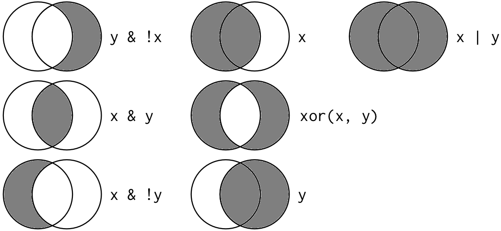

# Data wrangling part 1 {#sec-data_wrangling_1}

Get the lesson R script: [data_wrangling_1.R](data_wrangling_1.R)

Get the lesson data: [download zip](data/data.zip)

## Lesson Outline

* [Goals]
* [The tidyverse]
* [Data wrangling with `dplyr`]
* [Piping]

## Lesson Exercises

* [Exercise 4]
* [Exercise 5]

## Goals

Data wrangling (cleaning, manipulation, ninjery, etc.) is the part of any data analysis that will take the most time. While it may not be fun, it is necessary for the work that follows. I strongly believe that mastering these skills has more value than mastering a particular analysis.  Check out [this article](https://www.nytimes.com/2014/08/18/technology/for-big-data-scientists-hurdle-to-insights-is-janitor-work.html){target="_blank"} if you don't believe me.

We'll have two hours to cover parts 1 and 2 of data wrangling. It's unrealistic to expect that you will be a ninja wrangler after this training. As such, the goals are to expose you to fundamentals and to develop an appreciation of what's possible. I'll also provide resources that you can use for follow-up learning on your own.

After this lesson you should be able to answer (or be able to find answers to) the following:

* Why do we need to manipulate data?
* What is the tidyverse?
* What can you do with dplyr?
* What is piping?

## The tidyverse

The [tidyverse](https://www.tidyverse.org/){target="_blank"} is a set of packages that work in harmony because they share common data representations and design. The tidyverse package is designed to make it easy to install and load core packages from the tidyverse in a single command. With tidyverse, you'll be able to address all steps of data exploration.


From the excellent book, [R for Data Science](https://r4ds.hadley.nz/){target="_blank"} (2nd Ed.), **data exploration** is the art of looking at your data, rapidly generating hypotheses, quickly testing them, then repeating again and again and again.  Tools in the tidyverse also have direct application to more formal analyses with many of the other available R packages on [CRAN](https://cran.r-project.org/){target="_blank"}.

You should already have the tidyverse installed, but let's give it a go if you haven't done this part yet:

```{r}
#| eval: false
# install
install.packages('tidyverse')
```

After installation, we can load the package:
```{r}
#| message: true
# load
library(tidyverse)
```

Notice that the messages you get after loading are a bit different from other packages.  That's because tidyverse is a package that manages other packages (this is the only package I know of that serves this function).  Loading tidyverse will load all of the core packages:

-   [ggplot2](http://ggplot2.tidyverse.org){target="_blank"}, for data visualisation.
-   [dplyr](http://dplyr.tidyverse.org){target="_blank"}, for data manipulation.
-   [tidyr](http://tidyr.tidyverse.org){target="_blank"}, for data tidying.
-   [readr](http://readr.tidyverse.org){target="_blank"}, for data import.
-   [purrr](http://purrr.tidyverse.org){target="_blank"}, for functional programming.
-   [tibble](http://tibble.tidyverse.org){target="_blank"}, for tibbles, a modern re-imagining of data frames.
-   [stringr](http://stringr.tidyverse.org){target="_blank"}, for working with text strings.
-   [forcats](http://forcats.tidyverse.org){target="_blank"}, for working with factors.
-   [lubridate](http://lubridate.tidyverse.org){target="_blank"}, for working with dates and times.

Other packages (e.g., `readxl`) are also included but you will probably not use these as frequently.

A nice feature of tidyverse is the ability to check for and install new versions of each package:

```r
tidyverse_update()
#> The following packages are out of date:
#> 
#> • dbplyr        (2.3.2 -> 2.6.0)
#> • rlang         (1.1.7 -> 1.2.0)
#> • tibble        (3.2.1 -> 3.3.1)
#> • xml2          (1.5.2 -> 1.6.0)
#> 
#> Start a clean R session then run:
#> install.packages(c("dbplyr", "rlang", "tibble", "xml2"))
```

As you'll soon learn using R, there are often several ways to achieve the same goal.  The tidyverse provides tools to address problems that can be solved with other packages or even functions from the base installation.  Tidyverse is admittedly an *opinionated* approach to data exploration, but it's popularity and rapid growth within the R community is a testament to the power of the tools that are provided.

## Data wrangling with `dplyr`


The data wrangling process includes data import, tidying, and transformation.  The process directly feeds into, and is not mutually exclusive with, the *understanding* or modelling side of data exploration.  More generally, I consider data wrangling as the manipulation or combination of datasets for the purpose of analysis.

Wrangling begins with import and ends with an output of some kind, such as a plot or a model, but is more often a dataset that has been altered from a raw dataset to suit the needs of an analysis.  In a perfect world, the wrangling process is linear with no need for back-tracking.  In reality, we often uncover more information about a dataset, either through wrangling or modeling, that warrants re-evaluation or even gathering more data.  Data also come in many forms and the form you need for analysis is rarely the required form of the input data.  For these reasons, data wrangling will consume most of your time in data exploration.

**All wrangling is based on a purpose.**  No one wrangles for the sake of wrangling (usually), so the process always begins by answering the following two questions:

* What do my input data look like?
* What should my input data look like given what I want to do?

At the most basic level, going from what your input data looks like to what it needs to look like will require a few key operations.  Some common examples:

* Selecting specific variables
* Filtering observations by some criteria
* Adding or modifying existing variables
* Renaming variables
* Arranging rows by a variable
* Summarizing variables conditional on others

The `dplyr` package provides easy tools for these common data manipulation tasks. It is built to work directly with data frames and is one of the most heavily used packages in the tidyverse. The philosophy of dplyr is that one function does one thing and the name of the function says what it does. This is where the tidyverse generally departs from other packages and even base R.  It is meant to be easy, logical, and intuitive.  There is a lot of great info on dplyr. If you have an interest, I'd encourage you to look more. The vignettes are particularly good.

* [`dplyr` GitHub repo](https://github.com/hadley/dplyr){target="_blank"}
* [CRAN page: vignettes here](http://cran.rstudio.com/web/packages/dplyr/){target="_blank"}
* [Cheatsheet](https://rstudio.github.io/cheatsheets/data-transformation.pdf){target="_blank"}

I'll demonstrate the examples with the training dataset from the last lesson.

```{r}
library(here)

# import the data
metadat <- read_csv(here('data', 'metadat.csv'))

# see first six rows
head(metadat)

# dimensions
dim(metadat)

# column names
names(metadat)

# structure
str(metadat)
```

### Selecting

Let's begin using dplyr. Don't forget to load the tidyverse if you haven't done so already.  We can use the `select` function to, you guessed it, select columns.  

```{r}
# first, select some columns
dplyr_sel1 <- select(metadat, station_no, station_name, station_latitude, station_longitude)
head(dplyr_sel1)

# select everything but some columns
dplyr_sel2 <- select(metadat, -c(Waterbody_Name:region_district))
head(dplyr_sel2)
```

### Filtering

After selecting columns, you'll probably want to remove observations that don't fit some criteria.  We'll use the water quality data for this example. 

```{r}
# import water quality data
wqdat <- read_csv(here('data', 'wqdat.csv'))

# see first six rows
head(wqdat)

# dimensions
dim(dat)

# column names
names(wqdat)

# structure
str(wqdat)
```

Maybe you want to look at only one parameter or one station.

```{r}
# filter observations with high values
wqdat_temp <- filter(wqdat, parametertype_name == "Temperature, Water")
head(wqdat_temp)
dim(wqdat_temp)

# filter data for one station
wqdat_sta <- filter(wqdat, station_name == "Lake Panasoffkee 7")
head(wqdat_sta)
dim(wqdat_sta)
```

Filtering can take a bit of time to master because there are several ways to tell R what you want. Within the filter function, the working part is a *logical selection* of `TRUE` and `FALSE` values that are used to select rows (`TRUE` means I want that row, `FALSE` means I don't).  Every selection within the filter function, no matter how complicated, will always be a T/F vector.  This is similar to running queries on a database if you're familiar with SQL.

To use filtering effectively, you have to know how to select the observations you want using the comparison operators. R provides the standard suite: `>`, `>=`, `<`, `<=`, `!=` (not equal), and `==` (equal). When you're starting out with R, the easiest mistake to make is to use `=` instead of `==` when testing for equality.

Multiple logical selections to `filter()` can be combined. Every expression must be true in order for a row to be included in the output. You'll need to use Boolean operators: `&` is "and", `|` is "or", and `!` is "not". This is the complete set of Boolean operations.



Let's create some more complicated filtering examples.

```{r}
# all rows with water temperature greater than 25 C
filt1 <- filter(wqdat, parametertype_name == 'Temperature, Water' & value > 25)
head(filt1)

# all rows with water temperature greater than 25 C and less than 30 C
filt2 <- filter(wqdat, parametertype_name == 'Temperature, Water' & value > 25 & value < 30)
head(filt2)

# get rows for Lake Pansoffkee 7 or Lake Panasoffkee 4
filt3 <- filter(wqdat, station_name == "Lake Panasoffkee 7" | station_name == "Lake Panasoffkee 4")
head(filt3)

# another way to get rows that fulfill multiple criteria
filt4 <- filter(wqdat, station_name %in% c("Lake Panasoffkee 7", "Lake Panasoffkee 4"))
head(filt4)
```

### Mutating

Now that we've seen how to select columns and filter observations, maybe we want to add a new column or modify an existing one. In dplyr, `mutate` provides this functionality.

```{r}
# add a new column
dplyr_mut1 <- mutate(wqdat, dumb_column = 1)
head(dplyr_mut1)

# add a column as Value divided by 100
dplyr_mut2 <- mutate(wqdat, Value_p100 = value / 100)
head(dplyr_mut2)

# add a category column
dplyr_mut3 <- mutate(wqdat, category = ifelse(value < 10, 'low', 'high'))
head(dplyr_mut3)
```

Since the water quality data are collected on specific dates, we can also use `mutate` to convert the date column to different formats. The `lubridate` package allows us to easily extract different time components.  First, we want to make sure the timestamp column is ain the correct format.

```{r}
# check the class
class(wqdat$timestamp)

# check the timezone
attr(wqdat$timestamp, "tzone")
```

We'll need to convert the time zone from UTC to Eastern Time (`readxl::read_csv()` assumed UTC).  We'll use `mutate` and `lubridate::with_tz()` to convert the timestamp column to Eastern Time.  Note that the time zone is specified as "Etc/GMT+5", which is Eastern Time without daylight savings.

```{r}
# load lubridate
library(lubridate)

# convert to Eastern Time
wqdat <- mutate(wqdat, timestamp = with_tz(timestamp, tzone = "Etc/GMT+5"))
```

Now we can create extra columns for different time components.  This might be useful if we want to know what time of day most parameters are collected or if results vary seasonally (e.g., by month).

```{r}
# create new columns for year, month, day, and hour
wqdat_dates <- mutate(wqdat, 
  year = year(timestamp),
  month = month(timestamp),
  day = day(timestamp),
  hour = hour(timestamp)
)
head(wqdat_dates)
```

There are many more functions in `dplyr`, but you'll use the ones above the most.  As you can imagine, they are most effective when used together because there is never a single step in the data wrangling process.  After the exercise, we'll talk about how we can efficiently *pipe* functions to create a new data object.

## Exercise 4

Now that you know the basic functions in `dplyr` and how to use them, let's put them to use.  Using `wqdat`, let's select some columns of interest, filter by station, and rename one of the columns.

1.  Select the `timestamp`, `station_name`, `parametertype_name`, and `value` columns.  Assign this dataset to a new object in your workspace.

1. Using the new object, filter to get all rows where Station is equal to `'Lake Panasoffkee 8'` and parameter is equal to `Temperature, Water` (hint, filter by the `station_name` column and `parametertype_name`, don't forget to use `==`). 

1. Convert the `timestamp` column to the correct time zone (hing, use `mutate` with `with_tz` for timezone `"Etc/GMT+5"`). 

```{r}
#| eval: false
#| echo: true
#| code-fold: true
#| code-summary: "Click to show/hide solution"
ex1 <- select(wqdat, timestamp, station_name, parametertype_name, value)
ex1 <- filter(ex1, station_name == "Lake Panasoffkee 8" & `parametertype_name` == "Temperature, Water")
ex1 <- mutate(ex1, timestamp = force_tz(timestamp, tzone = "Etc/GMT+5"))
```

## Piping

A complete data wrangling exercise will always include multiple steps to go from the raw data to the output you need. Here's a terrible wrangling example using functions from base R:

```{r}
#| eval: false
cropdat <- rawdat[1:28]
savecols <- data.frame(cropdat$Party, cropdat$`Last Inventory Year (2015)`)
names(savecols) <- c('Party','2015')
savecols$rank2015 <- rank(-savecols$`2015`)
top10df <- savecols[savecols$rank2015 <= 10,]
basedat <- cropdat[cropdat$Party %in% top10df$Party,]
```

Technically, if this works it's not "wrong", but there are a couple of issues that can cause problems. First, the flow of functions to manipulate the data is not obvious and this makes your code very hard to read. Second, lots of unnecessary intermediates have been created in your workspace.  Anything that adds clutter should be avoided because R is fundamentally based on object assignments.  The less you assign to variables in your environment the easier it will be to navigate complex scripts.

The good news is that you now know how to use the dplyr functions to wrangle data.  The function names in dplyr were chosen specifically to be descriptive.  This will make your code much more readable than if you were using base R counterparts.  However, I haven't told you how to easily link the functions.  Fortunately, there's an easy fix to this problem.

Recent versions of R provide a very useful method called *piping* that will make wrangling a whole lot easier.  The idea is simple: a pipe (`|>`) is used to chain functions together.  The output from one function becomes the input to the next function in the pipe. This avoids the need to create intermediate objects and creates a logical progression of steps that demystify the wrangling process.

Consider the simple example:

```{r}
# not using pipes, select a column, filter rows
bad_ex <- select(wqdat, station_name, value)
bad_ex2 <- filter(bad_ex, value > 10)
```

With pipes, it looks like this:

```{r}
# with pipes, select a column, filter rows
good_ex <- wqdat |> 
  select(station_name, value) |>
  filter(value > 10)
```

Now we've created only one new object in our environment and we can clearly see that we select, then filter.  The only real coding differences are the use of a pipe operator and now the select and filter functions only include the relevant information.  You do not need to explicitly specify the data inputs in each function if you're using piping. The pipe will always use the input that comes from above.

A couple comments about piping:

* It is very annoying to type the pipe operator.  RStudio has a nice keyboard shortcut: `Crtl + Shift + M` for Windows (use `Cmd + Shift + M` on a mac). Using it a few times will commit it to muscle memory.
* It's convention to start a new function on the next line after a pipe operator.  This makes the code easier to read and you can also remove or comment out a single step in a long pipe.
* Don't make your pipes too long, limit them to a particular data object or task.

## Exercise 5

Now that we know how to pipe functions, let's repeat exercise 4.  You should already have code to select, filter, and mutate the data. Use the following to repeat the analysis but with pipes.  You should only have to create one data object in this exercise. 

Using your code from exercise four, try to replicate the steps __using pipes__.  The steps we used in exercise four were:

1. From wqdat, select the `timestamp`, `station_name`, `parametertype_name`, and `value` columns

1. Filter by `station_name` to get only station `"Lake Panasoffkee 8"` and `parametertype_name` to get only `"Temperature, Water"`

1. Correct the timezone for `timestamp` to `"Etc/GMT+5"` using `mutate` and `with_tz`.

```{r}
#| eval: false
#| echo: true
#| code-fold: true
#| code-summary: "Click to show/hide solution"
ex2 <- wqdat |> 
  select(timestamp, station_name, parametertype_name, value) |> 
  filter(station_name == "Lake Panasoffkee 8" & `parametertype_name` == "Temperature, Water") |> 
  mutate(timestamp = force_tz(timestamp, tzone = "Etc/GMT+5"))
head(ex2)
```

## Next time

Now you should be able to answer (or be able to find answers to) the following:

* Why do we need to manipulate data?
* What is the tidyverse?
* What can you do with dplyr?
* What is piping?

Next we'll continue with data wrangling.

## Attribution

Content in this lesson was pillaged extensively from the USGS-R training curriculum [here](https://github.com/USGS-R/training-curriculum){target="_blank"} and [R for data Science](https://github.com/hadley/r4ds){target="_blank"}.
