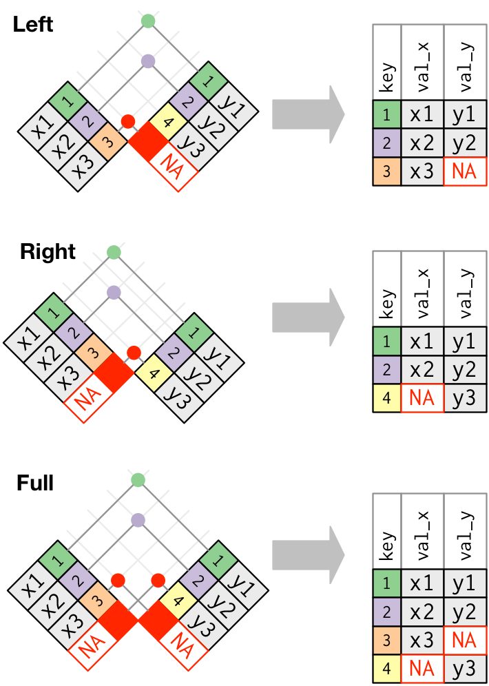
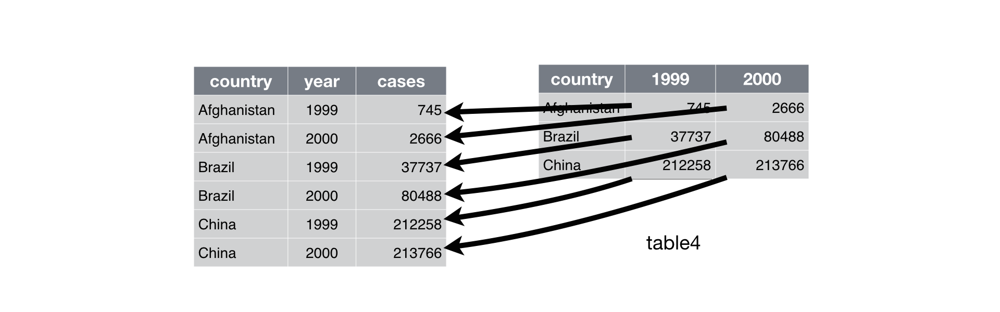
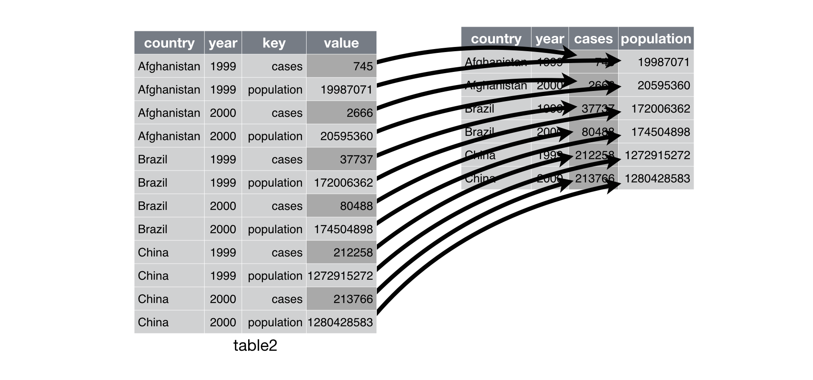

# Data wrangling part 2 {#sec-data_wrangling_2}

Get the lesson R script: [data_wrangling_2.R](data_wrangling_2.R)

Get the lesson data: [download zip](data/data.zip)

## Lesson Outline

* [Combining data]
* [Tidy data]
* [Summarize]

## Lesson Exercises

* [Exercise 6]
* [Exercise 7]
* [Exercise 8]

## Goals

In this lesson we'll continue our discussion of data wrangling with the tidyverse. Data wrangling is the manipulation or combination of datasets for the purpose of understanding.  It fits within the broader scheme of **data exploration**, described as the art of looking at your data, rapidly generating hypotheses, quickly testing them, then repeating again and again and again (from [R for Data Science](https://r4ds.hadley.nz/){target="_blank"}, 2nd Ed., as is most of today's content). 


Always remember that **wrangling is based on a purpose.** The process always begins by answering the following two questions:

* What do my input data look like?
* What should my input data look like given what I want to do?

You define what steps to take to get your data from input to where you want to go.

Last lesson we learned the following functions from the `dplyr` package (cheatsheet [here](https://rstudio.github.io/cheatsheets/data-transformation.pdf){target="_blank"}):

* Selecting variables with `select`
* Filtering observations by some criteria with `filter`
* Adding or modifying existing variables with `mutate`
* Working with the [lubridate](http://lubridate.tidyverse.org){target="_blank"} package 

As before, we only have one hour to cover the basics of data wrangling. It's an unrealistic expectation that you will be a ninja wrangler after this training. As such, the goals are to expose you to fundamentals and to develop an appreciation of what's possible. I also want to provide resources that you can use for follow-up learning on your own.

After this lesson you should be able to answer (or be able to find answers to) the following:

* How are data joined?
* What is tidy data?
* How do I summarize a dataset?

You should already have the tidyverse package installed, but let's give it a go if you haven't done this part yet:

```{r}
#| eval: false
# install
install.packages('tidyverse')
```

After installation, we can load the package:
```{r}
#| message: true
library(tidyverse)
```

## Combining data

Combining data is a common task of data wrangling.  Perhaps we want to combine information between two datasets that share a common identifier.  As a real world example, our training data contain measurements from various stations, but we also want to include spatial information about those stations (i.e., lat, lon).  We would need to combine data if this information is in two different places.  Combining data with dplyr is called joining.

All joins require that each of the tables can be linked by shared identifiers.  These are called 'keys' and are usually represented as a separate column that acts as a unique variable for the observations.  The `station_name` is our common key, but remember that a key might need to be unique for each row.  It doesn't make sense to join two tables by station if multiple site visits were made. In that case, your keys should include some information about the site visit **and** station. In other words, you would need to join with two variables.

### Types of joins

The challenge with joins is that the two datasets may not represent the same observations for a given key.  For example, you might have one table with all observations for every key, another with only some observations, or two tables with only a few shared keys.  What you get back from a join will depend on what's shared between tables, in addition to the type of join you use.

We can demonstrate types of joins with simple graphics. The first is an **inner-join**.


The second is an **outer-join**, and comes in three flavors: left, right, and full.



If all keys are shared between two data objects, then left, right, and full joins will give you the same result.  I typically only use left_join just because it's intuitive to me.  This assumes that there is never any more information in the second table - it has the same or less keys as the original table.

The data we downloaded for this training included station metadata and water quality measurements at the stations. If we want to plot any of the data by location, we need to join the two datasets. 

```{r}
library(here)

# load the metadata
metadat <- read_csv(here("data", "metadat.csv"))

# load the water quality data
wqdat <- read_csv(here("data", "wqdat.csv"))
```

Let's do some quick wrangling to get the data ready for joining.  We'll remove the unnecessary columns from `metadat` and make sure that `timestamp` in `wqdat` is in the correct format.

```{r}
# select station name, lat, lon
metadat <- metadat |> 
  select(station_name, station_latitude, station_longitude)

# format time zone
wqdat <- wqdat |> 
  mutate(timestamp = force_tz(timestamp, tzone = "Etc/GMT+5"))
```

Now we can join the two datasets.  We'll use `left_join()` to combine the two datasets by the `station_name` key.  We're using a `left_join` because we know that there are fewer unique stations in the water quality data than the metadata.  An `inner_join` would have also produced the same result.   The result will be a new dataset that contains all of the water quality data, plus the station latitude and longitude.

```{r}
# join the two 
joindat <- left_join(wqdat, metadat, by = 'station_name')
dim(joindat)
head(joindat)
```

A final note about joins is that you will have relationships between two tables defined as one-to-one, one-to-many, many-to-one, or many-to-many.  Often times you may expect a one-to-one join (i.e., one row in table x will always correspond to one row in table y), but another relationship is observed (e.g., one row in table x corresponds to more than one row in table y, a one-to-many join). The join functions in dplyr will notify you if this occurs depending on the type of join you use.  This is good because it tells you how to interpret the results of the join and whether or not you may have unexpected results.  In general, you should have a prior expectation of the relationship between two tables. You can be explicit with the type of relationship you expect by including the arguments `relationship = 'one-to-one'` (or other types) in your join function.

## Exercise 6

For this exercise we'll repeat the join we just did, but on a subset of the data. We're going to select some columns of interest from our training dataset, filter by station, then use `full_join()` with the station location data. Try to use pipes if you can. 

1. Select the `station_name`, `timestamp`, `parametertype_name`, and `value` columns from the water quality dataset.

1. Filter by `station_name` to get only station `"Lake Panasoffkee 8"` and `parametertype_name` to get only `"Temperature, Water"`

1. Use a `full_join` to join the dataset with the metadata.  What is the key value for joining?  

1. Check the dimensions of the new table.  What happened?

```{r}
#| results: hide
#| echo: true
#| code-fold: true
#| code-summary: "Click to show/hide solution"
# wrangle before join
joindat <- wqdat |> 
  select(station_name, timestamp, parametertype_name, value) |> 
  filter(station_name == "Lake Panasoffkee 8" & parametertype_name == "Temperature, Water")

dim(joindat)

# full join
joindat <- joindat |> 
  full_join(metadat, by = 'station_name')

dim(joindat)
```

## Tidy data

The opposite of a tidy dataset is a messy dataset.  You should always work towards a tidy data set as an outcome of the wrangling process.  Tidy data are easy to work with and will make downstream analysis much simpler.  This will become apparent when we start summarizing and plotting our data.

To help understand tidy data, it's useful to look at alternative ways of representing data. The example below shows the same data organised in four different ways. Each dataset shows the same values of four variables *country*, *year*, *population*, and *cases*, but each dataset organises the values differently. Only one of these examples is tidy.

```{r}
table1
table2
table3

# Spread across two tibbles
table4a  # cases
table4b  # population
```

These are all representations of the same underlying data but they are not equally easy to work with.  The tidy dataset is much easier to work with inside the tidyverse.

There are three inter-correlated rules which make a dataset tidy:

1.  Each variable must have its own column.
1.  Each observation must have its own row.
1.  Each value must have its own cell.


There are some very real reasons why you would encounter untidy data:

1.  Most people aren't familiar with the principles of tidy data, and it's hard
    to derive them yourself unless you spend a _lot_ of time working with data.

1.  Data is often organised to facilitate some use other than analysis. For
    example, data is often organised to make entry as easy as possible.

The [tidyr](https://tidyr.tidyverse.org/){target="_blank"} package can help you create tidy datasets. A full review of the functions in tidyr is beyond the scope of this training. Have a look at the [cheatsheet](https://rstudio.github.io/cheatsheets/tidyr.pdf){target="_blank"} to get started. Just know that the package is available to help create tidy data. 

For the example tables above, only the first table is tidy.  The second table, although not technically tidy (variables spread across rows), is still a useful format that we'll work with later. We'll talk about 
how to manipulate a dataset to work with both formats using two functions from tidyr: `pivot_longer()` and `pivot_wider()`.

### Values as column names

A common problem is a dataset where some of the column names are not names of variables, but _values_ of a variable. Take `table4a`: the column names `1999` and `2000` represent values of the `year` variable, and each row represents two observations, not one.

```{r}
table4a
```

To tidy a dataset like this, we need to combine those columns into a new pair of variables. To describe that operation we need three parameters:

* The set of columns that represent values, not variables. In this example,
  those are the columns `1999` and `2000`.

* The name of the variable whose values form the column name. Here it is `year`.

* The name of the variable whose values are spread over the cells. Here it's the number of `cases`.

Together those parameters generate the call to `pivot_longer()`:

```{r}
table4a |>
  pivot_longer(c('1999', '2000'), names_to = "year", values_to = "cases")
```

This operation can be graphically demonstrated:



### Observations across rows

Another problem is when you have a single observation scattered across rows.  For example, `table2` shows that the number of cases and population is spread across rows where the observation is country and year.

```{r}
table2
```

To tidy this up, we first analyse the representation in a similar way as before. This time, however, we only need to identify two things:

* The column that contains variable names. Here, it's
  `type`.

* The column that contains values from multiple variables. Here it's `count`.

Once we've figured that out, we can use `pivot_wider()`.

```{r}
pivot_wider(table2, names_from = 'type', values_from = 'count')
```

This operation can be graphically demonstrated:



## Exercise 7

Let's take a look at the water quality data. Are these data "tidy"? To demonstrate a different format, we'll use `pivot_wider()` to manipulate the data.

1. Inspect the water quality dataset.  What are the dimensions (hint: `dim()`)?  What are the names and column types (hint: `str()`)?

1. Remove the `unit_symbol` and `parametertype_shortname` columns and convert `timestamp` to date using `as.Date()`.  Assign the new dataset to a variable in your environment.  Why do we need to do this?

1. The data are in long format with parameters spread across rows.  We can convert it to wide format with one parameter per column using the `pivot_wider()` function. What value will you use for the `names_from` argument? What value will you use for the `values_from` argument?  Also add the argument `values_fn = mean`.  We'll explain what this does in a minute. Assign the new dataset to a variable in your environment.

1. Check the dimensions and structure of your new dataset. What's different?

```{r}
#| results: hide
#| echo: true
#| code-fold: true
#| code-summary: "Click to show/hide solution"
# check dimensions, structure
dim(wqdat)
str(wqdat)

# convert dat to wide format
widedat <- wqdat |>
  select(-unit_symbol, -parametertype_shortname) |>
  mutate(timestamp = as.Date(timestamp)) |> 
  pivot_wider(names_from = parametertype_name, values_from = value, values_fn = mean)

# check dimensions, structure
dim(widedat)
str(widedat)
```

## Summarize

The last tool we're going to learn about in `dplyr` is the `summarize` function.  As the name implies, this function lets you summarize columns in a dataset.  Think of it as a way to condense rows using a summary method of your choice, e.g., what's the average of the values in a column based on groups in another column?

We can use the `summarize()` function to get the total or average value by group.  Note the use of the `.by` argument as a critical piece that defines the groups for summarizing.  The mean function also uses the optional argument `na.rm = T` to remove missing values from the calculation, otherwise, the result will be `NA`.

```{r}
by_sta <- summarize(wqdat, mean_val = mean(value, na.rm = T), .by = c(station_name, parametertype_name))
by_sta
```

The below example is the same as the previous, except we're also grouping by year, first by creating the `Year` variable using `mutate()` and the `lubridate::year()` function.  The result is a summary of the average value by station, parameter, and year.

```{r}
by_sta_yr <- wqdat |> 
  mutate(Year = lubridate::year(timestamp)) |> 
  summarize(mean_val = mean(value, na.rm = TRUE), .by = c(station_name, parametertype_name, Year))
by_sta_yr
```

We can also get more than one summary at a time.  The summary function can use any function that operates on a vector.  Some common examples include `min()`, `max()`, `sd()`, `var()`, `median()`, `mean()`, and `n()`.  It's usually good practice to include a summary of how many observations were in each group, so get used to including the `n()` function.

```{r}
more_sums <- summarize(wqdat, 
    n = n(),
    min_val = min(value),
    max_val = max(value),
    mean_val = mean(value), 
    .by = c(station_name, parametertype_name)
  )
more_sums
```

## Exercise 8

Now we have access to a several tools in the tidyverse to help us wrangle more effectively.  For the final exercise, we're going to subset our training data and get a summary.  Specifically, we'll filter our data by a specific station and parameter, then summarize the average value by year. 

1. Using `wqdat`, filter the data by a specific station and parameter.

1. Summarize the value column by taking the average grouped by year.

1. Which year has the highest average value?

```{r}
#| results: hide
#| echo: true
#| code-fold: true
#| code-summary: "Click to show/hide solution"
sumdat <- wqdat |>
  filter(station_name == 'Lake Panasoffkee 4' & parametertype_name == 'Temperature, Water') |> 
  mutate(Year = lubridate::year(timestamp)) |> 
  summarize(
    ave = mean(value, na.rm = TRUE), 
    .by = Year
  ) |> 
  arrange(-ave)
sumdat
```

## Next time

Now you should be able to answer (or be able to find answers to) the following:

* How are data joined?
* What is tidy data?
* How do I summarize a dataset?

In the next lesson we'll learn about data visualization and graphics.

## Attribution

Content in this lesson was pillaged extensively from the USGS-R training curriculum [here](https://github.com/USGS-R/training-curriculum){target="_blank"} and [R for data Science](https://github.com/hadley/r4ds){target="_blank"}.
