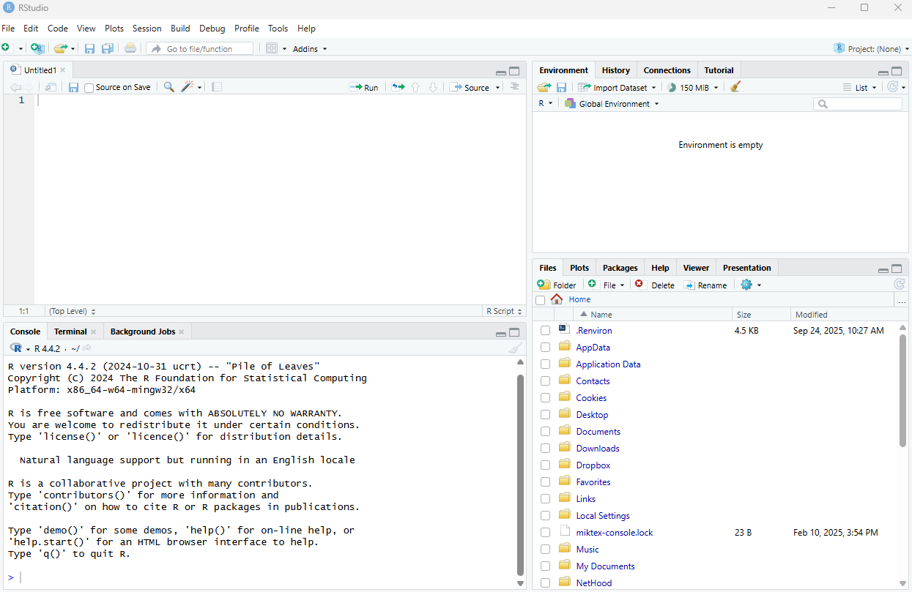

# Setup for the training {#setup}

Thanks for your interest in the Introduction to R training. You will need to do the following, outlined below, before the training. 

1. [Install R](#sec-instr)
1. [Install RStudio](#sec-instrstudio)

Most of these steps will require administrative privileges on a computer.  Work with your IT staff to complete the setup if you do not have these privileges.

Please reach out if you have any issues with installation: [mbeck@tbep.org](mailto:mbeck@tbep.org). Most of these instructions have been repurposed from the [USGS-R Training group](https://github.com/USGS-R/training-curriculum){target="_blank"} and [Data Carpentry](https://datacarpentry.org/R-ecology-lesson/index.html){target="_blank"}.

## Install R

**R** and **RStudio** are separate downloads and installations. R is the underlying statistical computing software. RStudio is a graphical integrated development environment (IDE) that makes using R much easier and more interactive. *You need to install R before you install RStudio*.

### Windows: Download and install R {#sec-instr}

Go to [CRAN and download](https://cran.rstudio.com/bin/windows/base/){target="_blank"} the R installer for Windows. Make sure to choose the latest stable version.

Once the installer downloads, Right-click on it and select "Run as administrator".

Type in your credentials and click yes (or if you don't have administrator access have your IT rep install with Admin privileges).

You can click next through the standard dialogs and accept most defaults. But at the destination screen, please verify that it is installing it to `C:\Program Files\R`

At the "Select Components" screen, make sure all items are checked.

At this screen, uncheck 'Create a desktop icon' because non-admin users in Windows will be unable to delete it.

Continue through the installer until the installation is complete.

### macOS: Download and install R

-   Download and install R from the CRAN website for Mac [here](https://cran.r-project.org/bin/macosx/){target="_blank"}.
-   Select the `.pkg` file for the latest R version
-   Double click on the downloaded file to install R
-   It is also a good idea to install [XQuartz](https://www.xquartz.org/){target="_blank"} (needed by some packages)

## Install RStudio 

### Windows: Download and install RStudio {#sec-instrstudio}

Download RStudio from [here](https://www.rstudio.com/products/rstudio/download/#download){target="_blank"}. Skip the step about installing R that was completed above.

Once the installer downloads, Right-click on it and select "Run as administrator".

Type in your credentials and click yes (or if you don't have administrator access have your IT rep install with Admin privileges).

Accept all the default options for the RStudio install.

### macOS: Download and install RStudio

-   Go to the [RStudio](https://www.rstudio.com/products/rstudio/download/#download){target="_blank"} download page
-   Under Installers select the appropriate RStudio download file for macOS
-   Double click the file to install RStudio

### Check Install

Once installed, RStudio should be accessible from the start menu. Start up RStudio. Once running it should look something like this:



## Install R packages

For this training you will need to install the following R packages. You can do this by running the following code in the RStudio console:

```r
install.packages(c('tidyverse', 'sf', 'mapview'))
```

If you encounter any errors during installation, please contact the instructor before the training day. __Installation issues will not be addressed the day of the training__.
