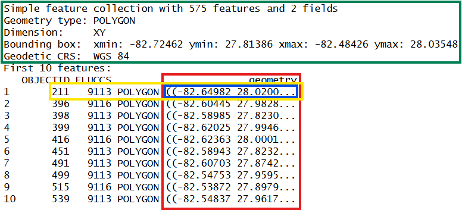

# Spatial data analysis {#sec-spatial_data_analysis}

Get the lesson R script: [spatial_data_analysis.R](spatial_data_analysis.R)

Get the lesson data: [download zip](data/data.zip)

## Lesson Outline

* [Vector data]
* [Simple features]
* [Creating spatial data with simple features]
* [Basic geospatial analysis]
* [Quick mapping]

## Lesson Exercises

* [Exercise 12]
* [Exercise 13]
* [Exercise 14]

R has been around for over thirty years and most of its use has focused on statistical analysis. Tools for spatial analysis have also been developed that allow the use of R as a full-blown GIS with capabilities similar or even superior to commercial software. This lesson will focus on geospatial analysis using the [simple features](https://r-spatial.github.io/sf/){target="_blank"} package. We will focus entirely on working with vector data in this lesson, but checkout the [terra](https://rspatial.github.io/terra/){target="_blank"} package if you want to work with raster data in R.

The goals for today are:

1. Understand the vector data structure

1. Understand how to import and structure vector data in R

1. Understand how R stores spatial data using the simple features package

1. Execute basic geospatial functions in R

## Vector data

Most of us are probably familiar with the basic types of spatial data and their components.  We're going to focus entirely on vector data for this lesson because these data are easily conceptualized as __features__ or discrete objects with spatial information.  We'll discuss some of the details about this later.  Raster data, by contrast, are stored in a grid with cells associated with values.  Raster data are more common for data with continuous coverage, such as climate or weather layers.  

Vector data come in three flavors.  The simplest is a __point__, which is a 0-dimensional feature that can be used to represent a specific location on the earth, such as a single monitoring station or an entire city. Linear, 1-dimensional features can be represented with points (or vertices) that are connected by a path to form a __line__ and when many points are connected these form a __polyline__. Finally, when a polyline's path returns to its origin to represent an enclosed 2-dimensional space, such as a watershed boundary, lake, or management area, this forms a __polygon__.


*Image [source](https://earthdatascience.org/courses/earth-analytics/spatial-data-r/intro-vector-data-r/){target="_blank"}*

All vector data are represented similarly, whether they're points, lines, or polygons.  Points are defined by a single coordinate location, whereas a line or polygon include several points with a grouping variable that distinguishes one object from another. In all cases, the aggregate dataset is composed of one or more features of the same type (points, lines, or polygons).

There are two other pieces of information that are included with vector data.  The __attributes__ that can be associated with each feature and the __coordinate reference system__ or __CRS__.  The attributes can be any supporting information about a feature, such as a text description or summary data about the features.  You can identify attributes as anything in a spatial dataset that is not explicitly used to define the location (or geometry) of the features.  

The CRS is used to establish a frame of reference for the locations in your spatial data.  The chosen CRS ensures that all features are correctly referenced relative to each other, especially between different datasets.  As a simple example, imagine comparing length measurements for two objects where one was measured in centimeters and another in inches.  If you didn't know the unit of measurement, you could not compare relative lengths.  The CRS is similar in that it establishes a common frame of reference, but for spatial data.  An added complication with spatial data is that location can be represented in both 2-dimensional or 3-dimensional space. This is beyond the scope of this lesson, but for any geospatial analysis you should be sure that:

1. the CRS is the same when comparing datasets, and 

1. the CRS is appropriate for the region you're looking at.    

 

*Image [source](https://x.com/mourner/status/1458169016456032260){target="_blank"}*

To summarize, vector data include the following:

1. spatial data (e.g., latitude, longitude) as points, lines, or polygons

1. attributes

1. a coordinate reference system

These are all the pieces of information you need to recognize in your data when working with features in R.

## Simple features

R has a long history of packages for working with spatial data.  For many years, the [sp](https://cran.r-project.org/web/packages/sp/index.html){target="_blank"} package was the standard and most widely used toolset for working with spatial data in R. This package laid the foundation for creating spatial data classes and methods in R, but unfortunately its development predated a lot of the newer tools that are built around the [tidyverse](https://www.tidyverse.org/){target="_blank"}.  This makes it incredibly difficult to incorporate `sp` data objects with these newer data analysis workflows.  

The simple features or [sf](https://r-spatial.github.io/sf/){target="_blank"} package was developed to streamline the use of spatial data in R and to align its functionality with those provided in the tidyverse.  The sf package has replaced sp as the fundamental spatial model in R for vector data.  A major advantage of sf, as you'll see, is its intuitive data structure that retains many familiar components of the `data.frame` (or more accurately, `tibble`).

The sf package provides a hierarchical data model that represents a wide range of geometry types - it includes all common vector geometry types and even allows geometry collections, which can have multiple geometry types in a single object. From the first sf package [vignette](https://r-spatial.github.io/sf/articles/sf1.html){target="_blank"} we see:


You'll notice that these are the same features we described above, with the addition of "multi" features and geometry collections that include more than one type of feature.

## Exercise 12

Let's get setup for this lesson.  We'll make sure we have the necessary packages installed and loaded.  Then we'll import our datasets. 

1. Open a new script in your RStudio project.  

1. At the top of the script, load the `tidyverse`, `sf`, and `mapview` libraries.  Don't forget you can use `install.packages(c('tidyverse', 'sf', 'mapview'))` if the packages aren't installed.

1. Load the training datasets from your data folder.  For CSV files, use `read_csv()` and for shapefiles, use the `st_read()` function from the `sf` package.  As before, assign each loaded dataset to an object in your workspace.  

```{r}
#| echo: true
#| message: false
#| warning: false
#| results: hide
#| code-fold: true
#| code-summary: "Click to show/hide solution"
# load libraries
library(tidyverse)
library(sf)
library(mapview)

# load the training data
dat <- read_csv('data/dat.csv')

# load the station location data
statloc <- read_csv('data/statloc.csv')

# load the spatial boundary shapefile
bounds <- st_read('data/bounds.shp')
```

## Creating spatial data with simple features

Now that we're setup, let's talk about how the `sf` package can be used.  After the package is loaded, you can check out all of the methods that are available for `sf` data objects.  Many of these names will look familiar if you're familiar with geospatial analysis methods.  We'll use some of these later.

```{r}
methods(class = 'sf')
```

All of the functions and methods in sf are prefixed with `st_`, which stands for 'spatial and temporal'.  This is kind of confusing but this is in reference to standard methods available in [PostGIS](https://en.wikipedia.org/wiki/PostGIS){target="_blank"}, an open-source backend that is used by many geospatial platforms.  An advantage of this prefixing is all commands are easy to find with command-line completion in sf, in addition to having naming continuity with the core, prior software.

There are two ways to create a spatial data object in R, i.e., an `sf` object, using the sf package.

1. Directly import a shapefile

1. Convert an existing R object with latitude/longitude data that represent point features

We've already imported a shapefile in [Exercise 12], so let's look at its structure to better understand the `sf` object. The `st_read()` function can be used for import.  Setting `quiet = T` will keep R from being chatty when it imports the data.

```{r}
bounds <- st_read('data/bounds.shp', quiet = T)
bounds
```

What does this show us? Let's break it down.



* In green, metadata describing components of the `sf` object
* In yellow, a simple feature: a single record, or `data.frame` row, consisting of attributes and geometry
* In blue, a single simple feature geometry (an object of class `sfg`)
* In red, a simple feature list-column (an object of class `sfc`, which is a column in the data.frame)

You'll notice that the actual dataset looks very similar to a regular `data.frame`, with some interesting additions.  The header includes some metadata about the `sf` object and the `geometry` column includes the actual spatial information for each feature.  Conceptually, you can treat the `sf` object like you would a `data.frame`.   

Easy enough, but what if we have point data that's not a shapefile?  You can create an `sf` object from any existing `data.frame` so long as the data include coordinate information (e.g., columns for longitude and latitude) and you are 100% certain about the CRS.  We can do this with our `statloc` csv file that we imported. 

```{r}
str(statloc)
```

The `st_as_sf()` function can be used to make this `data.frame` into a `sf` object.  We must identify which columns contain the coordinates and provide the CRS information, which is WGS84.  You can use the EPSG code `4326` to indicate WGS84.

```{r}
sfstatloc <- st_as_sf(statloc, coords = c('Longitude', 'Latitude'), crs = 4326)
sfstatloc
```

A big part of working with spatial data is keeping track of coordinate reference systems between different datasets.  Remember that meaningful comparisons between datasets are only possible if the CRS is the same.  

There are many, many types of reference systems and plenty of resources online that provide detailed explanations of the what and why behind the CRS (see [spatialreference.org](http://www.spatialreference.org/){target="_blank"} or [this guide](https://www.nceas.ucsb.edu/~frazier/RSpatialGuides/OverviewCoordinateReferenceSystems.pdf){target="_blank"} from NCEAS).  For now, just realize that we can use a simple text string in R to indicate which CRS we want.

## Exercise 13

Our training dataset can be made a simple features spatial object by joining it with the corresponding station location data. Let's join the training data and station location datasets and create an `sf` object using `st_as_sf()`.  

1. Join the training data to the station locations using the `left_join()` function with `by = "Station"` as the key. 

1. Use `st_as_sf()` to make the joined dataset an `sf` object.  There are two arguments you need to specify with `st_as_sf()`: `coords = c('Longitude', 'Latitude')` so R knows which columns in your dataset are the x/y coordinates and `crs = 4326` to specify the CRS as WGS 84.  

1. When you're done, inspect the dataset.  How many features are there?  What type of spatial object is this? 

```{r}
#| echo: true
#| message: false
#| results: hide
#| code-fold: true
#| code-summary: "Click to show/hide solution"
# Join the data
alldat <- left_join(dat, statloc, by = 'Station')

# create spatial data object
alldat <- st_as_sf(alldat, coords = c('Longitude', 'Latitude'), crs = 4326)

# examine the sf object
alldat
str(alldat)
```

There's a shortcut for specifying the CRS if you don't know which one to use.  Remember, for spatial analysis make sure to only work with datasets that have the same coordinate reference systems.  The `st_crs()` function tells us the CRS for an existing `sf` object. 

```{r}
# check crs
st_crs(alldat)
```

When we created the `alldat` dataset, we could have used the CRS from the `bounds` object that we created in [Exercise 12] by using `crs = st_crs(bounds)` for the `crs` argument.  This is possible because we have prior knowledge that all of the data use the WGS84 CRS.  This is often a quick shortcut for creating an `sf` object without having to look up the CRS number.  

We can verify that both have the same CRS.

```{r}
# verify the polygon and point data have the same crs
st_crs(bounds)
st_crs(alldat)
```

Finally, you may want to use another coordinate system, such as a projection that is regionally-specific.  You can use the `st_transform()` function to quickly change and/or reproject an `sf` object.  For example, if we want to convert a geographic to UTM projection: 

```{r}
alldatutm <- alldat |> 
  st_transform(crs = '+proj=utm +zone=17 +datum=NAD83 +units=m +no_defs')
st_crs(alldatutm)
```

Above, we've used the "Proj4string" format of the CRS, instead of the EPSG code.  This is another perfectly acceptable way to specify a CRS.  Also note that transformations can only be done after the original data are correctly imported using the native CRS of the dataset.

## Basic geospatial analysis

Let's perform some simple geospatial analysis comparing our training data with the spatial boundaries. As with any analysis, let's take a look at the data to see what we're dealing with before we start comparing the two.  

```{r}
plot(alldat)
plot(bounds)
```

We have lots of stations and polygons representing management areas or boundaries.  You'll also notice that the default plotting method for `sf` objects is to create one plot per attribute feature.  This is intended behavior but sometimes is not that useful.  Maybe we just want to see where the data are located independent of any of the attributes.  We can accomplish this by plotting only the geometry of the `sf` object.

```{r}
plot(alldat$geometry)
plot(bounds$geometry)
```

To emphasize the point that the `sf` package plays nice with the tidyverse, let's do a simple filter on the data to look at only a subset. This is the same approach we used in the data wrangling lessons.  

```{r}
filt_dat <- alldat |> 
  filter(Station == 'A')
plot(filt_dat$geometry)
```

Now let's use our data and spatial polygons to do a quick geospatial analysis.  Our simple question is:

__Which management areas contain monitoring stations?__

The first task is to subset the station data by locations that fall within a management area.  There are a few ways we can do this.  The first is to make a simple subset where we filter the station locations using a spatial overlay with the boundary polygons. 

```{r}
stat_crop <- alldat[bounds, ]
plot(stat_crop$geometry)
stat_crop
```

The second and more complete approach is to intersect the two data objects to subset and combine the attributes. We can use `st_intersection()` to both overlay and combine the attribute fields from the two data objects.

```{r}
stat_int <- st_intersection(alldat, bounds)
plot(stat_int$geometry)
stat_int
```

Now we can easily see which stations are in which polygon.  We can use some familiar tools from dplyr to get the aggregate data for the different polygon areas.

```{r}
area_summary <- stat_int |>
  group_by(AreaName) |> 
  summarise(
    mean_val = mean(Value, na.rm = TRUE)
  ) 
area_summary
```

Notice that we've retained the `sf` data structure in the aggregated dataset but the structure is now slightly different.  The `geometry` column is retained but now is aggregated to a multipoint object where all points within each area are grouped by row. This is a really powerful feature of `sf`: spatial attributes are retained during the wrangling process.  

We can also visualize this information with ggplot2. 

```{r}
#| message: false
ggplot(area_summary, aes(x = AreaName, y = mean_val)) + 
  geom_bar(stat = 'identity')
```

## Quick mapping 

Cartography or map-making is also very doable in R.  Like most applications, it takes very little time to create something simple, but much more time to create a finished product.  We'll focus on the simple process using [ggplot2](https://ggplot2.tidyverse.org/reference/ggsf.html){target="_blank"} and the [mapview](https://r-spatial.github.io/mapview/){target="_blank"} package just to get you started.  Both packages work "out-of-the-box" with `sf` data objects. 

For ggplot2, all we need is to use the `geom_sf()` geom.  

```{r}
# use ggplot with sf objects
ggplot() + 
  geom_sf(data = bounds, aes(fill = AreaName)) + 
  geom_sf(data = stat_int) 
```

The mapview package lets us create interactive maps to zoom and select data.  Note that we can also combine separate mapview objects with the `+` operator.

```{r}
mapview(bounds, zcol = 'AreaName') +
  mapview(stat_int)
```

There's a lot more we can do with mapview but the point is that these maps are incredibly easy to make with `sf` objects and they offer a lot more functionality than static plots.

## Exercise 14

We'll spend the remaining time getting more comfortable with basic geospatial analysis and mapping in R.  

1. Start by filtering the `alldat` object you created in [Exercise 13] to retain only data from a specific time period or station. Intersect the filtered data with the `bounds` object using `st_intersection()`.

1. Create a map of this intersected object using `mapview()`.  Use the `zcol` argument to map the color values to different attributes in your dataset.  

1. Try combining the map you made in the last step with one for the boundary polygons (hint: `mapview() + mapview()`).

```{r}
#| echo: true
#| message: false
#| results: hide
#| code-fold: true
#| code-summary: "Click to show/hide solution"
# filter and intersect data
tomap <- alldat |> 
  filter(Station == 'A') |> 
  st_intersection(bounds)

# make maps
mapview(tomap, zcol = 'Value')

# join maps
mapview(bounds, zcol = 'AreaName') + mapview(tomap, zcol = 'Value')
```

## Next steps

Now you should be able to: 

1. Understand the vector data structure

1. Understand how to import and structure vector data in R

1. Understand how R stores spatial data using the simple features package

1. Execute basic geospatial functions in R

This concludes our training. I hope you've enjoyed the material and found the content useful. Please continue to use this website as a resource for developing your R skills and checkout our [Data and Resources](data_resources.html) page for additional learning material.
