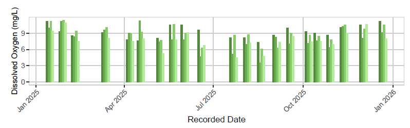
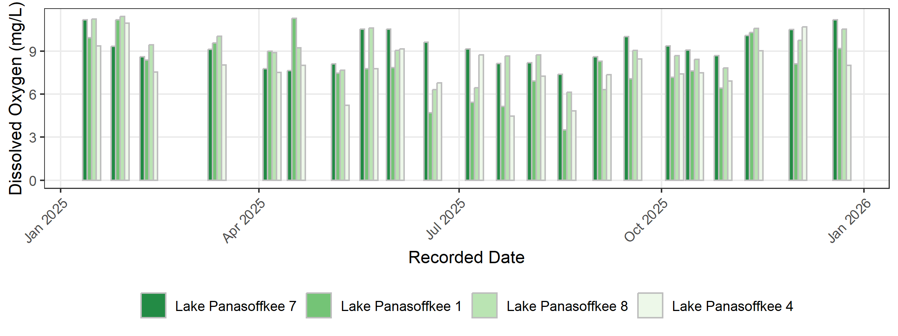
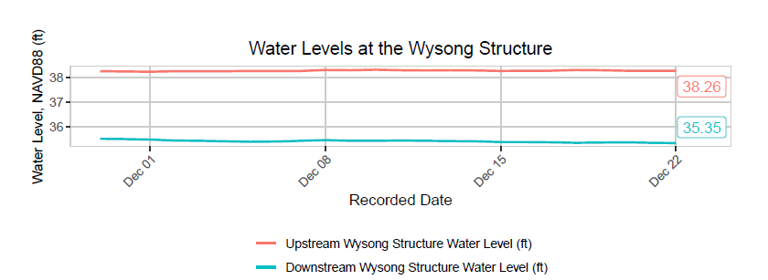
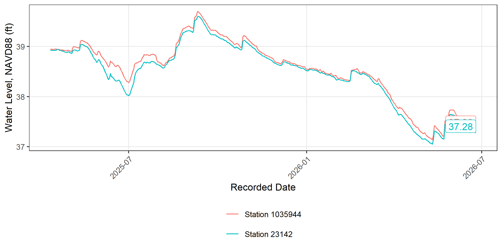
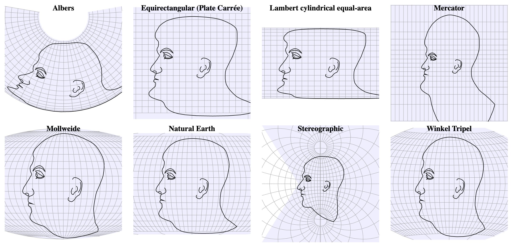
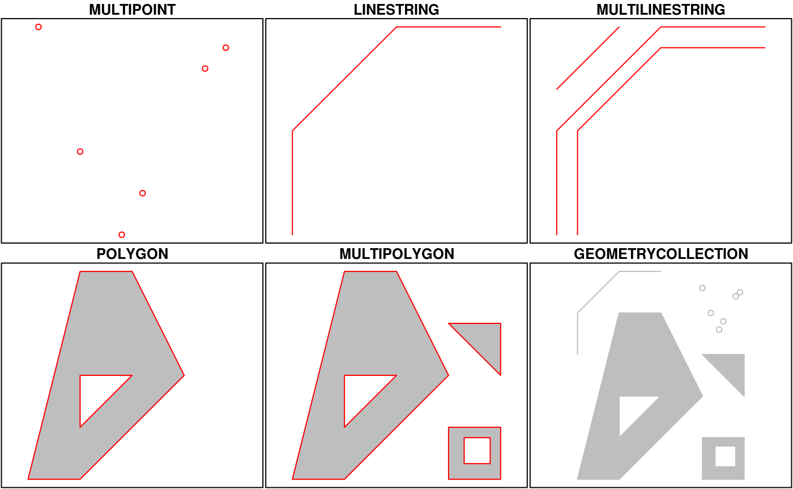

# SWFWMD examples {#sec-swfwmd_examples}

Get the lesson R script: [swfwmd_examples.R](swfwmd_examples.R)

Get the lesson data: [download zip](data/data.zip)

## Lesson Outline

* [Summary plots]
* [Time series plots]
* [Maps]

## Lesson Exercises

* [Exercise 11]
* [Exercise 12]
* [Exercise 13]

Now we should be at a point where we can run through a complete analysis workflow, from data import all the way to data product.  In this lesson, we'll recreate some of the plots provided in this [SWFWMD report](Lake-Pan-Report-%2020251222.pdf) for Lake Panasoffkee. 

The goal for this lesson is to learn how to conceptualize and execute a complete data analysis workflow.  To do this, you will need to know where you're starting and where you need to go and what pieces are needed in between.  The examples provided will demonstrate how to do this and will use methods from the prior lessons to develop the workflows.

First, let's load the packages we'll be using. 

```{r}
library(tidyverse)
library(here)
library(sf)
library(mapview)
```

## Summary plots

We'll reproduce this figure using our water quality data. 



Take a moment to evaluate the figure. What does it show you?  Do we have the right data to recreate it?  What do we need to do to our data to plot it?

Let's look at our water quality data.  We'll load it from the `wqdat.csv`, but you could also just retrieve it again using the URL from the first lesson.

```{r}
wqdat <- read_csv(here('data', 'wqdat.csv'))
str(wqdat)
```

There are a number of things we need to do to prepare this for plotting.  

1. Filter stations of interest
1. Filter by parameter
1. Filter by year
1. Create a date column
1. Convert stations to factor levels for plot order
1. Summarize the parameter by station and date

```{r}
# a station vector so we don't have to type out all the names
stas <- paste('Lake Panasoffkee', c(7, 1, 8, 4))

# wrangle the data
toplo <- wqdat |> 
  dplyr::filter(station_name %in% stas) |> 
  dplyr::filter(parametertype_name == 'Dissolved Oxygen') |> 
  dplyr::filter(year(timestamp) == 2025) |> 
  mutate(
    date = as.Date(timestamp), 
    station_name = factor(station_name, levels = stas)
  ) |> 
  summarise(
    value = mean(value, na.rm = T), 
    .by = c(date, station_name)
  )

str(toplo)
```

Now we're ready to plot. The final plot looks relatively simple, but there's a number of things we need to do to replicate the styling.

1. Setup the aesthetics
1. "dodge" the bars by date
1. Use a green color palette
1. Chang the overall theme
1. Move the legend to the bottom and remove the title
1. Angle the x-axis text
1. Modify the plot grid lines
1. Make nice labels

Let's first create the initial plot.  

```{r}
ggplot(toplo, aes(x = date, y = value)) +
  geom_col()
```

The first plot grouped all the stations together.  We can use the fill aesthetic to distinguish them.

```{r}
ggplot(toplo, aes(x = date, y = value, fill = station_name)) +
  geom_col()
```

The stations are currently stacked on top of each other. We can place them next to each other for each date using the position argument in `geom_col()`.  We'll also add a grey color outline (you'll see why later). 

```{r}
ggplot(toplo, aes(x = date, y = value, fill = station_name)) +
  geom_col(position = position_dodge(), color = 'grey')
```

Next we can change the color using `scale_fill_brewer()`.

```{r}
ggplot(toplo, aes(x = date, y = value, fill = station_name)) + 
  geom_col(position = position_dodge(), color = 'grey') + 
  scale_fill_brewer(palette = 'Greens', direction = -1)
```

The rest is just plot aesthetics.  We can globally apply the `theme_bw()` theme.

```{r}
ggplot(toplo, aes(x = date, y = value, fill = station_name)) + 
  geom_col(position = position_dodge(), color = 'grey') + 
  scale_fill_brewer(palette = 'Greens', direction = -1) + 
  theme_bw()
```

Then we can us the `theme()` function to modify several components at on: `axis.text.x` modifies the text on the x-axis, `legend.position` changes the location of the legend, and `panel.grid.minor` controls the "minor" gridlines.

```{r}
ggplot(toplo, aes(x = date, y = value, fill = station_name)) + 
  geom_col(position = position_dodge(), color = 'grey') + 
  scale_fill_brewer(palette = 'Greens', direction = -1) + 
  theme_bw(base_size = 18) + 
  theme(
    axis.text.x = element_text(angle = 45, hjust = 1), 
    legend.position = 'bottom', 
    panel.grid.minor = element_blank()
  )
```

Now we add our nice labels and we're done!

```{r} 
ggplot(toplo, aes(x = date, y = value, fill = station_name)) + 
  geom_col(position = position_dodge(), color = 'grey') + 
  scale_fill_brewer(palette = 'Greens', direction = -1) + 
  theme_bw() + 
  theme(
    axis.text.x = element_text(angle = 45, hjust = 1), 
    legend.position = 'bottom', 
    panel.grid.minor = element_blank()
  ) +
  labs(
    x = 'Recorded Date', 
    y = 'Dissolved Oxygen (mg/L)', 
    fill = NULL
  ) 
```

To get the width and height to match the original plot, you can save it using RStudio's built in save feature or use any of the available graphics devices.  Here we use the `png()` function after first assigning the plot to object `p`.  The output should look like the figure below.

```{r}
p <- ggplot(toplo, aes(x = date, y = value, fill = station_name)) + 
  geom_col(position = position_dodge(), color = 'grey') + 
  scale_fill_brewer(palette = 'Greens', direction = -1) + 
  theme_bw() + 
  theme(
    axis.text.x = element_text(angle = 45, hjust = 1), 
    legend.position = 'bottom', 
    panel.grid.minor = element_blank()
  ) +
  labs(
    x = 'Recorded Date', 
    y = 'Dissolved Oxygen (mg/L)', 
    fill = NULL
  ) 

png(here('figs/swfwmd_examples', 'dosummary.png'), height = 3, width = 8, units = 'in', res = 300)
print(p)
dev.off()
```



## Time series plots

Next, we'll create a plot similar to this one using our water level data from the first lesson.



Take a moment to evaluate the figure. What does it show you? Do we have the right data to recreate it? What do we need to do to our data to plot it?

Let's look at our water level data. This time, we have two separate files, one for each station: `wldat1.csv` and `wldat2.csv`. Each file needs quite a bit of cleanup before we can combine them.

There are a number of things we need to do to prepare these data for plotting.

1. Import each station's file and remove the header rows
1. Rename the date and level columns to meaningful names
1. Convert the date and level columns to the correct data types
1. Join the two station datasets by date
1. Reshape the joined data to long format
1. Create a label for each station
1. Get the most recent date's values to use for point labels

```{r}
wldat1 <- read_csv(here('data', 'wldat1.csv')) |>
  slice(5:n()) |>
  rename(
    date = X.station_no,
    levelft = X1035944
  ) |>
  mutate(
    date = as.Date(date),
    levelft = as.numeric(levelft)
  )

wldat2 <- read_csv(here('data', 'wldat2.csv')) |>
  slice(5:n()) |>
  rename(
    date = X.station_no,
    levelft = X23142
  ) |>
  mutate(
    date = as.Date(date),
    levelft = as.numeric(levelft)
  )

str(wldat1)
str(wldat2)
```

Now we can join the two station datasets by date and reshape to long format so we have a single column for water level with a column identifying the station.

```{r}
toplo <- inner_join(wldat1, wldat2, by = 'date', suffix = c('_1035944', '_23142')) |>
  pivot_longer(-date) |>
  separate(name, c('var', 'station')) |>
  mutate(
    station = paste('Station', station)
  )

str(toplo)
```

We also need a separate dataset with only the most recent date so we can label the lines with the current water level.

```{r}
toplopts <- toplo |>
  filter(date == max(date))

toplopts
```

Now we're ready to plot. As before, the final plot requires several styling additions.

1. Setup the aesthetics and plot the lines
1. Add labels showing the most recent value for each station
1. Change the overall theme
1. Move the legend to the bottom and arrange it over two rows
1. Angle the x-axis text
1. Modify the plot grid lines
1. Make nice labels

Let's first create the initial plot with a line for each station.  We're using a different "geom" here, `geom_line()`, which is used to plot lines instead of bars.

```{r}
ggplot(toplo, aes(x = date, y = value, color = station)) +
  geom_line()
```

Next, we can add labels showing the most recent water level for each station, using the `toplopts` data we created above.  We'll have to get fancy with some of the arguments so that we can see the actual labels (there are much better ways of doing this using the [ggrepel](https://cran.r-project.org/web/packages/ggrepel/index.html){target="_blank"} package, but we'll keep it simple for now).

```{r}
ggplot(toplo, aes(x = date, y = value, color = station)) +
  geom_line() +
  geom_label(data = toplopts, aes(label = value), hjust = "inward", vjust = "inward", show.legend = F)
```

As before, we can apply `theme_bw()` and use `theme()` to angle the x-axis text, move the legend to the bottom, and remove the minor gridlines.

```{r}
ggplot(toplo, aes(x = date, y = value, color = station)) +
  geom_line() +
  geom_label(data = toplopts, aes(label = value), hjust = "inward", vjust = "inward", show.legend = F) +
  theme_bw() +
  theme(
    axis.text.x = element_text(angle = 45, hjust = 1),
    legend.position = 'bottom',
    panel.grid.minor = element_blank()
  )
```

We can use `guides()` to wrap the legend across two rows.  I always have to Google this step...

```{r}
ggplot(toplo, aes(x = date, y = value, color = station)) +
  geom_line() +
  geom_label(data = toplopts, aes(label = value), hjust = "inward", vjust = "inward", show.legend = F) +
  theme_bw() +
  theme(
    axis.text.x = element_text(angle = 45, hjust = 1),
    legend.position = 'bottom',
    panel.grid.minor = element_blank()
  ) +
  guides(color = guide_legend(nrow = 2, byrow = TRUE))
```

Now we add our nice labels and we're done!

```{r}
ggplot(toplo, aes(x = date, y = value, color = station)) +
  geom_line() +
  geom_label(data = toplopts, aes(label = value), hjust = "inward", vjust = "inward", show.legend = F) +
  theme_bw() +
  theme(
    axis.text.x = element_text(angle = 45, hjust = 1),
    legend.position = 'bottom',
    panel.grid.minor = element_blank()
  ) +
  guides(color = guide_legend(nrow = 2, byrow = TRUE)) +
  labs(
    x = 'Recorded Date',
    y = 'Water Level, NAVD88 (ft)',
    color = NULL
  )
```

We can save it using the same method as before to get the dimensions similar to the original plot. 

```{r}
p <- ggplot(toplo, aes(x = date, y = value, color = station)) +
  geom_line() +
  geom_label(data = toplopts, aes(label = value), hjust = "inward", vjust = "inward", show.legend = F) +
  theme_bw() +
  theme(
    axis.text.x = element_text(angle = 45, hjust = 1),
    legend.position = 'bottom',
    panel.grid.minor = element_blank()
  ) +
  guides(color = guide_legend(nrow = 2, byrow = TRUE)) +
  labs(
    x = 'Recorded Date',
    y = 'Water Level, NAVD88 (ft)',
    color = NULL
  )

png(here('figs/swfwmd_examples', 'tsplot.png'), height = 3.5, width = 8, units = 'in', res = 300)
print(p)
dev.off()
```



## Maps 

Cartography or map-making is also very doable in R.  Like most applications, it takes very little time to create something simple, but much more time to create a finished product.  We'll focus on the simple process using [ggplot2](https://ggplot2.tidyverse.org/reference/ggsf.html){target="_blank"} and the [mapview](https://r-spatial.github.io/mapview/){target="_blank"} package just to get you started.  Both packages work "out-of-the-box" with `sf` data objects. 

Most of us are probably familiar with the basic types of spatial data and their components.  We're going to focus on vector data for this example because these data are easily conceptualized as __features__ or discrete objects with spatial information. Raster data, by contrast, are stored in a grid with cells associated with values.  Raster data are more common for data with continuous coverage, such as climate or weather layers.  

Vector data come in three flavors.  The simplest is a __point__, which is a 0-dimensional feature that can be used to represent a specific location on the earth, such as a single monitoring station or an entire city. Linear, 1-dimensional features can be represented with points (or vertices) that are connected by a path to form a __line__ and when many points are connected these form a __polyline__. Finally, when a polyline's path returns to its origin to represent an enclosed 2-dimensional space, such as a watershed boundary, lake, or management area, this forms a __polygon__.


*Image [source](https://earthdatascience.org/courses/earth-analytics/spatial-data-r/intro-vector-data-r/){target="_blank"}*

All vector data are represented similarly, whether they're points, lines, or polygons.  Points are defined by a single coordinate location, whereas a line or polygon include several points with a grouping variable that distinguishes one object from another. In all cases, the aggregate dataset is composed of one or more features of the same type (points, lines, or polygons).

There are two other pieces of information that are included with vector data.  The __attributes__ that can be associated with each feature and the __coordinate reference system__ or __CRS__.  The attributes can be any supporting information about a feature, such as a text description or summary data about the features.  You can identify attributes as anything in a spatial dataset that is not explicitly used to define the location (or geometry) of the features.  

The CRS is used to establish a frame of reference for the locations in your spatial data.  The chosen CRS ensures that all features are correctly referenced relative to each other, especially between different datasets.  As a simple example, imagine comparing length measurements for two objects where one was measured in centimeters and another in inches.  If you didn't know the unit of measurement, you could not compare relative lengths.  The CRS is similar in that it establishes a common frame of reference, but for spatial data.  An added complication with spatial data is that location can be represented in both 2-dimensional or 3-dimensional space. This is beyond the scope of this lesson, but for any geospatial analysis you should be sure that:

1. the CRS is the same when comparing datasets, and 

1. the CRS is appropriate for the region you're looking at.    

 

*Image [source](https://x.com/mourner/status/1458169016456032260){target="_blank"}*

To summarize, vector data include the following:

1. spatial data (e.g., latitude, longitude) as points, lines, or polygons

1. attributes

1. a coordinate reference system

These are all the pieces of information you need to recognize in your data when working with features in R.

### Simple features

R has a long history of packages for working with spatial data.  For many years, the [sp](https://cran.r-project.org/web/packages/sp/index.html){target="_blank"} package was the standard and most widely used toolset for working with spatial data in R. This package laid the foundation for creating spatial data classes and methods in R, but unfortunately its development predated a lot of the newer tools that are built around the [tidyverse](https://www.tidyverse.org/){target="_blank"}.  This makes it incredibly difficult to incorporate `sp` data objects with these newer data analysis workflows.  

The simple features or [sf](https://r-spatial.github.io/sf/){target="_blank"} package was developed to streamline the use of spatial data in R and to align its functionality with those provided in the tidyverse.  The sf package has replaced sp as the fundamental spatial model in R for vector data.  A major advantage of sf, as you'll see, is its intuitive data structure that retains many familiar components of the `data.frame` (or more accurately, `tibble`).

The sf package provides a hierarchical data model that represents a wide range of geometry types - it includes all common vector geometry types and even allows geometry collections, which can have multiple geometry types in a single object. From the first sf package [vignette](https://r-spatial.github.io/sf/articles/sf1.html){target="_blank"} we see:



You'll notice that these are the same features we described above, with the addition of "multi" features and geometry collections that include more than one type of feature.

### Creating spatial data with simple features

Now that we're setup, let's talk about how the `sf` package can be used.  After the package is loaded, you can check out all of the methods that are available for `sf` data objects.  Many of these names will look familiar if you're familiar with geospatial analysis methods.  We'll use some of these later.

```{r}
methods(class = 'sf')
```

All of the functions and methods in sf are prefixed with `st_`, which stands for 'spatial and temporal'.  This is kind of confusing but this is in reference to standard methods available in [PostGIS](https://en.wikipedia.org/wiki/PostGIS){target="_blank"}, an open-source backend that is used by many geospatial platforms.  An advantage of this prefixing is all commands are easy to find with command-line completion in sf, in addition to having naming continuity with the core, prior software.

There are two ways to create a spatial data object in R, i.e., an `sf` object, using the sf package.

1. Directly import a shapefile using `st_read()`

1. Convert an existing R object with latitude/longitude data that represent point features

You can create an `sf` object from any existing `data.frame` so long as the data include coordinate information (e.g., columns for longitude and latitude) and you are 100% certain about the CRS.  We can do this with our `metadat` csv file. First, we'll import it and clean it up a bit before we create the `sf` object.

```{r}
metadat <- read_csv(here('data', 'metadat.csv')) |> 
  select(station_name, station_longitude, station_latitude, WBID)
```

The `st_as_sf()` function can be used to make this `data.frame` into a `sf` object.  We must identify which columns contain the coordinates and provide the CRS information, which is WGS84.  You can use the EPSG code `4326` to indicate WGS84.

```{r}
sfmetadat <- st_as_sf(metadat, coords = c('station_longitude', 'station_latitude'), crs = 4326)
sfmetadat
```

What does this show us? Let's break it down.


* In green, metadata describing components of the `sf` object
* In yellow, a simple feature: a single record, or `data.frame` row, consisting of attributes and geometry
* In blue, a single simple feature geometry (an object of class `sfg`)
* In red, a simple feature list-column (an object of class `sfc`, which is a column in the data.frame)

You'll notice that the actual dataset looks very similar to a regular `data.frame`, with some interesting additions.  The header includes some metadata about the `sf` object and the `geometry` column includes the actual spatial information for each feature.  Conceptually, you can treat the `sf` object like you would a `data.frame`.   

### Coordinate reference systems

A big part of working with spatial data is keeping track of coordinate reference systems between different datasets.  Remember that meaningful comparisons between datasets are only possible if the CRS is the same.  

There are many, many types of reference systems and plenty of resources online that provide detailed explanations of the what and why behind the CRS (see [spatialreference.org](http://www.spatialreference.org/){target="_blank"} or [this guide](https://www.nceas.ucsb.edu/~frazier/RSpatialGuides/OverviewCoordinateReferenceSystems.pdf){target="_blank"} from NCEAS).  For now, just realize that we can use a simple text string in R to indicate which CRS we want.

You may want to use another coordinate system, such as a projection that is regionally-specific.  You can use the `st_transform()` function to quickly change and/or reproject an `sf` object.  For example, if we want to convert a geographic to UTM projection: 

```{r}
sfmetadatutm <- sfmetadat |> 
  st_transform(crs = '+proj=utm +zone=17 +datum=NAD83 +units=m +no_defs')
st_crs(sfmetadatutm)
```

Above, we've used the "Proj4string" format of the CRS, instead of the EPSG code.  This is another perfectly acceptable way to specify a CRS.  Also note that transformations can only be done after the original data are correctly imported using the native CRS of the dataset.

### Creating the map

Now that we've got the background info out of the way, we can focus on creating the map. For ggplot2, all we need is to use the `geom_sf()` geom.  

```{r}
# use ggplot with sf objects
ggplot() + 
  geom_sf(data = sfmetadat, aes(fill = WBID))
```

The mapview package lets us create interactive maps to zoom and select data.
```{r}
mapview(sfmetadat, zcol = 'WBID')
```

There's a lot more we can do with mapview but the point is that these maps are incredibly easy to make with `sf` objects and they offer a lot more functionality than static plots.

## Exercise 14

## Next steps

This concludes our training. I hope you've enjoyed the material and found the content useful. Please continue to use this website as a resource for developing your R skills and checkout our [Data and Resources](data_resources.html) page for additional learning material.
